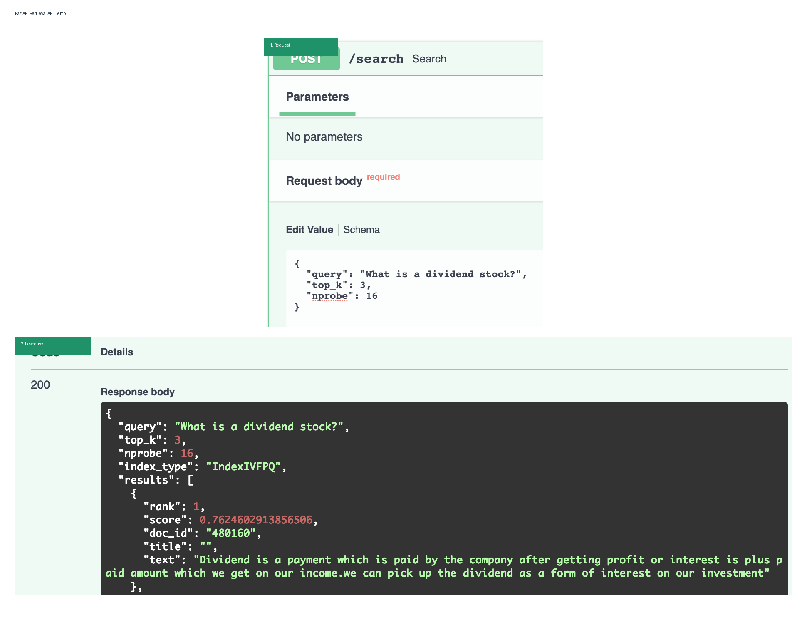

# AI Embedding Compression for RAG Retrieval

[](https://github.com/ravan-chuang/Embedding_Compression_for_RAG_Retrieval/actions/workflows/ci.yml)
[](LICENSE)
[](https://github.com/facebookresearch/faiss)
[](docs/docker_api.md)

A GPU benchmark and deployable retrieval system for embedding compression and approximate nearest-neighbor search in Retrieval-Augmented Generation (RAG).

This project separates two questions that are often conflated:

1. **Compression quality:** How much retrieval quality remains after compressing document embeddings?
2. **Retrieval efficiency:** How much latency and throughput improvement is obtained when searching directly in compressed Product Quantization (PQ) code space?

## Highlights

- Evaluates Float32, INT8, INT4, PQ, OPQ, IVF-PQ, and OPQ-IVF-PQ.
- Uses FiQA and SciFact / BEIR relevance benchmarks across MiniLM and BGE-small embedding models instead of document-to-document nearest-neighbor proxies.
- Measures Recall@5, Recall@10, MRR@10, nDCG@10, storage cost, latency, and QPS.
- Implements genuine GPU compressed-domain retrieval with Faiss IVF-PQ ADC; document vectors are not reconstructed to Float32 during ANN search.
- Exports a deployable MiniLM OPQ-IVF-PQ artifact, including the learned query-side rotation matrix required for serving.
- Ships a verified FastAPI retrieval service, Docker Compose deployment, metadata regeneration flow, unit tests, and GitHub Actions CI.

## Benchmark Setup

| Item | Configuration |
|---|---|
| Primary benchmark | FiQA / BEIR |
| FiQA corpus / queries | 57,638 documents / 648 queries |
| Cross-dataset validation | SciFact / BEIR: 5,183 documents / 300 queries |
| Primary deployment model | `sentence-transformers/all-MiniLM-L6-v2` |
| Cross-model validation | `BAAI/bge-small-en-v1.5` |
| Embedding dimension | 384 for both evaluated models |
| Retrieval metrics | Recall@5, Recall@10, MRR@10, nDCG@10 |
| ANN backend | Faiss GPU IVF-PQ ADC |
| GPU | NVIDIA Tesla T4 |
| IVF configuration | `nlist=256`; representative ANN setting: `nprobe=16` |

## Methods

### Reconstructed-vector quality evaluation

These methods compress document vectors, reconstruct dense vectors, then evaluate retrieval quality with dense GPU search:

- Float32 baseline
- INT8 scalar quantization
- INT4 scalar quantization
- Product Quantization (PQ)
- Optimized Product Quantization (OPQ) + PQ

This mode evaluates compression distortion and ranking preservation. It does **not** claim compressed-domain search acceleration.

### Compressed-domain GPU ANN evaluation

These methods use Faiss GPU indexes directly:

- `GpuIndexFlatIP`: exact Float32 dense retrieval baseline
- `GpuIndexIVFPQ`: compressed-domain IVF-PQ ADC retrieval
- PyTorch-learned OPQ rotation + `GpuIndexIVFPQ`
- Native Faiss `OPQMatrix` + `GpuIndexIVFPQ` comparison

For IVF-PQ, document vectors remain encoded as PQ codes during search. Faiss uses asymmetric distance computation (ADC) rather than reconstructing every document embedding.

## Main GPU ADC Quality Results

| Method | nprobe | Analytical compression | Serialized deployment compression | Recall@10 | nDCG@10 |
|:--|--:|--:|--:|--:|--:|
| GPU Float32 FlatIP | – | 1.00× | 1.00× | 0.4413 | 0.3687 |
| PyTorch OPQ-IVF-PQ M=96 | 16 | 13.59× | 12.01× | 0.4081 | 0.3462 |
| IVF-PQ M=96 | 16 | 14.94× | 13.05× | 0.4085 | 0.3442 |
| PyTorch OPQ-IVF-PQ M=96 | 64 | 13.59× | 12.01× | 0.4216 | 0.3548 |

At the deployed `M=96, nprobe=16` configuration, PyTorch OPQ-IVF-PQ retains about **92.5%** of Float32 Recall@10 and **93.9%** of Float32 nDCG@10 while reducing serialized deployment storage by about **12.01×**.

The serialized deployment figure includes the external `384 × 384` FP32 query-side OPQ rotation matrix. The analytical compression figure describes the index coding budget only.

## Cross-Dataset Validation: SciFact / BEIR

To test whether the FiQA trade-off is specific to a single financial-QA corpus, the same embedding model and ANN configuration were evaluated on SciFact / BEIR.

| Method | `nprobe` | Serialized deployment compression | Recall@10 | nDCG@10 |
|:--|--:|--:|--:|--:|
| GPU Float32 FlatIP | – | 1.00× | 0.7833 | 0.6451 |
| IVF-PQ M=96 | 16 | 6.00× | 0.7206 | 0.5975 |
| PyTorch OPQ-IVF-PQ M=96 | 16 | 4.15× | 0.7056 | 0.5906 |
| Native Faiss OPQMatrix-IVF-PQ M=96 | 16 | 4.15× | 0.7156 | 0.5969 |

The SciFact experiment uses 5,183 documents and 300 judged queries. At `M=96, nprobe=16`, the strongest OPQ baseline was the native Faiss `OPQMatrix` configuration, while plain IVF-PQ slightly outperformed the PyTorch-learned OPQ variant on Recall@10 and nDCG@10.

This is evidence of **cross-dataset evaluation**, not a claim that one OPQ implementation universally wins. The relative OPQ benefit is dataset-dependent, and SciFact is too small to support a million-scale ANN speed claim.

## Cross-Model Validation: MiniLM × BGE-small

The same `M=96`, `nlist=256`, `nprobe=16` protocol was also evaluated with
`BAAI/bge-small-en-v1.5`. The table below reports the quality trade-off across
two datasets and two embedding models. Compression ratios are serialized deployment
ratios, including the external FP32 OPQ rotation when required.

| Dataset | Model | Method | Recall@10 | nDCG@10 | Serialized compression |
|:--|:--|:--|--:|--:|--:|
| FiQA | MiniLM | Float32 FlatIP | 0.4413 | 0.3687 | 1.00× |
| FiQA | MiniLM | IVF-PQ M=96 | 0.4085 | 0.3442 | 13.05× |
| FiQA | MiniLM | PyTorch OPQ-IVF-PQ M=96 | 0.4081 | 0.3462 | 12.01× |
| FiQA | MiniLM | Native Faiss OPQMatrix-IVF-PQ M=96 | 0.4157 | 0.3470 | 12.01× |
| SciFact | MiniLM | Float32 FlatIP | 0.7833 | 0.6451 | 1.00× |
| SciFact | MiniLM | IVF-PQ M=96 | 0.7206 | 0.5975 | 6.00× |
| SciFact | MiniLM | PyTorch OPQ-IVF-PQ M=96 | 0.7056 | 0.5906 | 4.15× |
| SciFact | MiniLM | Native Faiss OPQMatrix-IVF-PQ M=96 | 0.7156 | 0.5969 | 4.15× |
| FiQA | BGE-small | Float32 FlatIP | 0.4396 | 0.3848 | 1.00× |
| FiQA | BGE-small | IVF-PQ M=96 | 0.3966 | 0.3453 | 13.05× |
| FiQA | BGE-small | PyTorch OPQ-IVF-PQ M=96 | 0.4048 | 0.3545 | 12.01× |
| FiQA | BGE-small | Native Faiss OPQMatrix-IVF-PQ M=96 | 0.4067 | 0.3555 | 12.01× |
| SciFact | BGE-small | Float32 FlatIP | 0.8452 | 0.7200 | 1.00× |
| SciFact | BGE-small | IVF-PQ M=96 | 0.7991 | 0.6861 | 6.00× |
| SciFact | BGE-small | PyTorch OPQ-IVF-PQ M=96 | 0.8012 | 0.6863 | 4.15× |
| SciFact | BGE-small | Native Faiss OPQMatrix-IVF-PQ M=96 | 0.8108 | 0.6881 | 4.15× |

### Interpretation

- **PyTorch OPQ helps on both BGE-small experiments:** it improves over plain IVF-PQ on FiQA (`+0.0082` Recall@10, `+0.0092` nDCG@10) and SciFact (`+0.0021` Recall@10, `+0.0002` nDCG@10).
- **MiniLM behavior is dataset-dependent:** PyTorch OPQ improves FiQA nDCG@10 slightly but underperforms plain IVF-PQ on SciFact.
- **Native Faiss `OPQMatrix` is the strongest and most stable OPQ baseline** among the evaluated configurations. The custom PyTorch implementation is retained as a reproducible learned-rotation and serving pipeline, not claimed as a universal replacement for Faiss OPQ.
- **BGE-small is stronger on SciFact:** its Float32 baseline reaches `0.8452` Recall@10 and `0.7200` nDCG@10, compared with MiniLM's `0.7833` and `0.6451`.

## Corrected GPU Faiss Search Timing

The following values measure **GPU Faiss search only**. Quality uses all 648 FiQA queries, while latency and QPS use the 640 full-size queries from 10 batches of 64; the final 8-query tail is excluded from latency percentiles to avoid distortion.

| Method | Batch size | P95 per-query search latency | Search throughput |
|:--|--:|--:|--:|
| GPU Float32 FlatIP | 64 | 0.028350 ms | 35,553.88 q/s |
| IVF-PQ M=96, nprobe=16 | 64 | 0.018839 ms | 53,983.10 q/s |
| PyTorch OPQ-IVF-PQ M=96, nprobe=16 | 64 | 0.019044 ms | 54,260.55 q/s |
| PyTorch OPQ-IVF-PQ M=96, nprobe=64 | 64 | 0.065608 ms | 15,401.17 q/s |

These numbers exclude embedding generation, HTTP transport, artifact loading, and response serialization. They must not be compared directly with the Docker API latency below.

## Figures

### Storage-quality trade-off


### Repeated-run throughput stability


## Methodology

For experimental modes, storage accounting, latency protocol, and interpretation rules, see [Benchmark Methodology](docs/benchmark_methodology.md).

## Key Findings

- **Deployment-aware compression accounting matters:** the external OPQ query rotation is required at serving time, so serialized deployment storage is lower than the analytical index-only compression ratio.
- **The benchmark now covers two datasets × two embedding models:** FiQA and SciFact are evaluated with MiniLM and BGE-small under the same IVF-PQ / OPQ protocol.
- **PyTorch OPQ is cross-model but not universally dominant:** it improves both BGE-small experiments, while its MiniLM behavior is dataset-dependent.
- **Native Faiss `OPQMatrix` remains the strongest OPQ baseline:** it is the most stable quality performer across all evaluated dataset-model pairs.
- **Higher `nprobe` improves quality at a throughput cost:** `nprobe=64` recovers more retrieval quality but increases search latency.
- **ANN speedup requires candidate pruning:** full-scan PQ is not automatically faster than dense GPU retrieval at this corpus scale; IVF candidate pruning creates the main ANN throughput benefit.
- **Small corpora are not a scale benchmark:** SciFact validates ranking behavior in another domain, but its 5,183-document corpus is not evidence of million-scale ANN performance.
- **Batching matters:** benchmark timing is measured over true matrix search calls, not repeated single-query calls.

## Retrieval API

The repository includes a local FastAPI retrieval service backed by the exported FiQA **OPQ-IVF-PQ** artifact.

The deployed artifact contains:

```text
artifacts/fiqa_opq_ivfpq_m96/
├── index.faiss
├── query_opq_rotation.npy
├── doc_ids.json
└── service_config.json
```

`documents.jsonl` is intentionally ignored by Git because it is reproducible metadata derived from FiQA / BEIR. The Docker entrypoint recreates it automatically when missing.

The serving path is:

```text
query
→ sentence-transformers embedding
→ L2 normalization
→ query @ OPQ rotation
→ Faiss IndexIVFPQ search
→ document metadata lookup
```

The API exposes:

- `GET /health` for service and artifact readiness.
- `POST /search` for single-query top-k retrieval.
- `POST /batch-search` for true micro-batched retrieval: queries are embedded together and sent to Faiss in one matrix search call.

The OPQ contract is validated by the service configuration. When `query_transform.enabled` is true, the retriever loads `query_opq_rotation.npy` and applies it before Faiss search.

### Local API setup

On macOS Apple Silicon, install Faiss through conda-forge to avoid mixing native Faiss and OpenMP runtimes from Conda and pip:

```bash
conda env create -f environment.yml
conda activate rag-api
pip install -r requirements-api.txt
```

If the environment already exists:

```bash
conda activate rag-api
conda install -c conda-forge faiss-cpu
pip install -r requirements-api.txt
```

Generate the local FiQA metadata copy:

```bash
ARTIFACT_DIR=artifacts/fiqa_opq_ivfpq_m96 \
python scripts/prepare_fiqa_documents.py
```

Run the service:

```bash
uvicorn app.main:app
```

Open the interactive API documentation at:

```text
http://127.0.0.1:8000/docs
```

Example requests:

```bash
curl http://127.0.0.1:8000/health
```

```bash
curl -X POST http://127.0.0.1:8000/search \
  -H "Content-Type: application/json" \
  -d '{"query":"What is a dividend stock?","top_k":5,"nprobe":16}'
```

```bash
curl -X POST http://127.0.0.1:8000/batch-search \
  -H "Content-Type: application/json" \
  -d '{"queries":["What is a dividend stock?","How does inflation affect bond prices?"],"top_k":3,"nprobe":16}'
```

A verified Docker `POST /search` request returned `query_transform_enabled: true` and relevant dividend-related FiQA passages, confirming that the deployed API uses the OPQ query transform.

For the full artifact contract and operational notes, see [Retrieval API](docs/retrieval_api.md).

### Local API benchmark

The repository includes a real HTTP benchmark for the running service. It measures client-visible end-to-end latency, API-reported retrieval latency, and query throughput.

```bash
python scripts/benchmark_api.py --warmup 5 --runs 30 --batch-sizes 1 8 32
```

Run this benchmark after changing the artifact, model, hardware, or serving configuration. Its results are CPU application measurements, including HTTP, query embedding, OPQ rotation, Faiss search, and response assembly; they are not directly comparable to the GPU-only Faiss search benchmark above.

## API Demo

The Swagger UI below shows a verified `POST /search` request against the serialized FiQA `IndexIVFPQ` artifact.



### Docker deployment

The service is containerized and verified with Docker Compose:

```bash
docker compose up --build
```

The first start generates the reproducible FiQA metadata file and downloads the embedding model. Once ready, open:

```text
http://127.0.0.1:8000/docs
```

Verify the deployed artifact:

```bash
curl http://127.0.0.1:8000/health
```

Expected fields include:

```json
{
  "artifact_dir": "artifacts/fiqa_opq_ivfpq_m96",
  "index_type": "IndexIVFPQ",
  "document_count": 57638
}
```

Then verify the OPQ query transform:

```bash
curl -X POST http://127.0.0.1:8000/search \
  -H "Content-Type: application/json" \
  -d '{"query":"What is a dividend stock?","top_k":3}'
```

The response should contain:

```json
"query_transform_enabled": true
```

See [Docker API](docs/docker_api.md).

### Testing and CI

The repository includes **7 offline unit tests** for artifact consistency, retriever behavior, batch search, and endpoint logic.

```bash
pip install -r requirements-dev.txt
pytest -q
```

GitHub Actions runs the test suite on pushes to `main` and pull requests. See [Testing and CI](docs/testing_ci.md).

## Repository Structure

```text
.github/
  workflows/
    ci.yml
app/
  main.py
  retriever.py
artifacts/
  fiqa_opq_ivfpq_m96/
    index.faiss
    query_opq_rotation.npy
    service_config.json
    doc_ids.json
docker/
  entrypoint.sh
docs/
  api_benchmark.md
  benchmark_methodology.md
  docker_api.md
  retrieval_api.md
  testing_ci.md
figures/
  storage_quality_tradeoff.png
  throughput_stability.png
notebooks/
  Ai_embedding_compression.ipynb
  SciFact_OPQ_IVFPQ_Benchmark.ipynb
  FiQA_BGE_Small_OPQ_IVFPQ_Benchmark.ipynb
  SciFact_BGE_Small_OPQ_IVFPQ_Benchmark.ipynb
results/
  api_benchmark/
  fiqa_gpu_benchmark/
  scifact_gpu_benchmark/
  fiqa_bge_small_gpu_benchmark/
  scifact_bge_small_gpu_benchmark/
scripts/
  benchmark_api.py
  export_service_artifacts.py
  prepare_fiqa_documents.py
tests/
  test_api.py
  test_artifact_contract.py
  test_retriever.py
Dockerfile
docker-compose.yml
environment.yml
environment-ci.yml
requirements-api.txt
requirements-dev.txt
requirements-ci.txt
```

## Reproducibility

### FiQA serving and primary MiniLM benchmark

1. Open `notebooks/Ai_embedding_compression.ipynb` in Google Colab.
2. Enable an NVIDIA GPU runtime.
3. Run all cells from top to bottom.
4. The notebook exports FiQA GPU benchmark artifacts and the deployed MiniLM OPQ-IVF-PQ service artifact.

### MiniLM cross-dataset validation

1. Open `notebooks/SciFact_OPQ_IVFPQ_Benchmark.ipynb`.
2. Enable an NVIDIA GPU runtime and run all cells.
3. The notebook writes independent outputs under `scifact_rag_results/`; it does not overwrite the deployed FiQA API artifact.

### BGE-small cross-model validation

1. Open `notebooks/FiQA_BGE_Small_OPQ_IVFPQ_Benchmark.ipynb` and run all cells.
2. Open `notebooks/SciFact_BGE_Small_OPQ_IVFPQ_Benchmark.ipynb` and run all cells.
3. These notebooks write independent outputs under `fiqa_bge_small_rag_results/` and `scifact_bge_small_rag_results/`.
4. They are benchmark-only and do not overwrite the deployed MiniLM FiQA artifact.

For all GPU experiments, use Google Colab with an NVIDIA GPU runtime and install `requirements-colab.txt`.

## Limitations and Next Steps

- FiQA has 57,638 documents and SciFact has 5,183 documents. The two datasets and two models improve generalization evidence, but they do not establish million-scale ANN behavior.
- The benchmark currently uses two English embedding models; it does not yet validate multilingual or Traditional Chinese retrieval.
- The deployment uses a learned external OPQ transform; any compatible serving implementation must apply the same query rotation before Faiss search.
- Future work includes a 100K–1M vector scale benchmark, a Traditional Chinese retrieval benchmark, reranking, query-aware retrieval routing, model-specific deployment selection, and production observability / deployment hardening.

## Release Readiness

The repository now represents a retrieval-engineering workflow with initial cross-dataset and cross-model validation:

```text
FiQA GPU benchmark → serialized MiniLM OPQ-IVF-PQ artifact + query rotation
→ FastAPI serving → Docker metadata regeneration
→ Docker end-to-end verification → automated CI
→ FiQA + SciFact × MiniLM + BGE-small validation
```

The next milestone is a `v1.3.0` cross-model validation release. It should include the two BGE-small notebooks and this README summary, while retaining the verified MiniLM FiQA artifact as the deployed service baseline.
