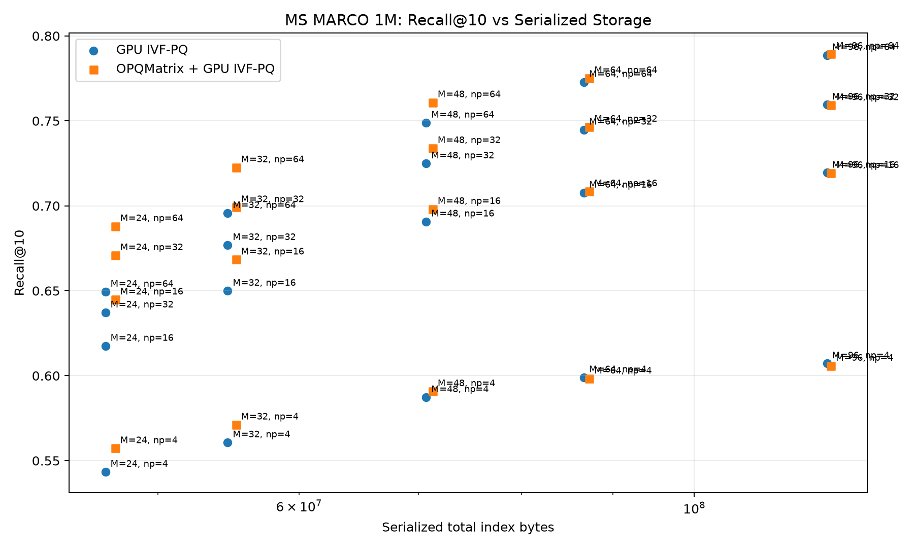
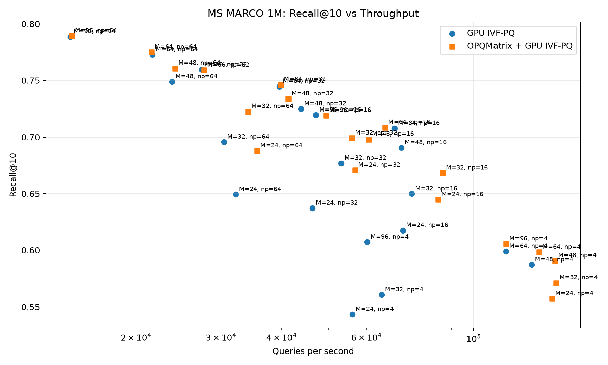
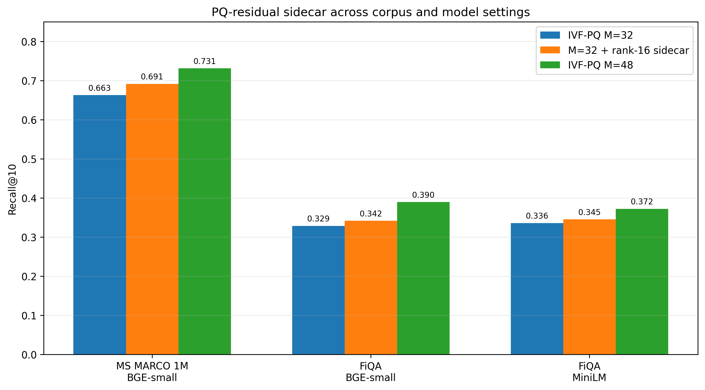
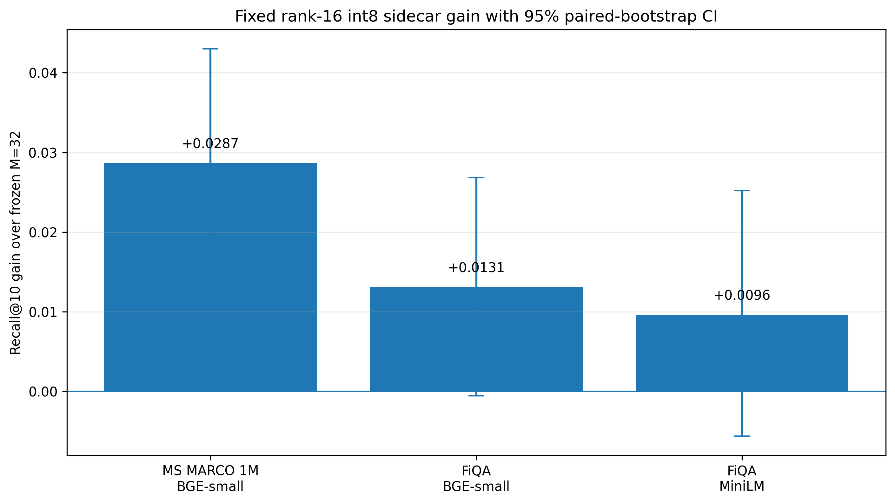
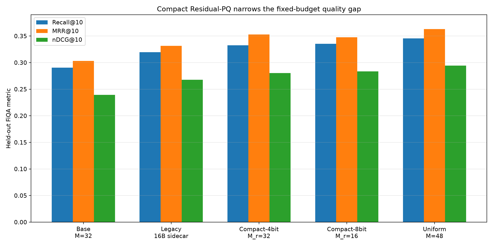
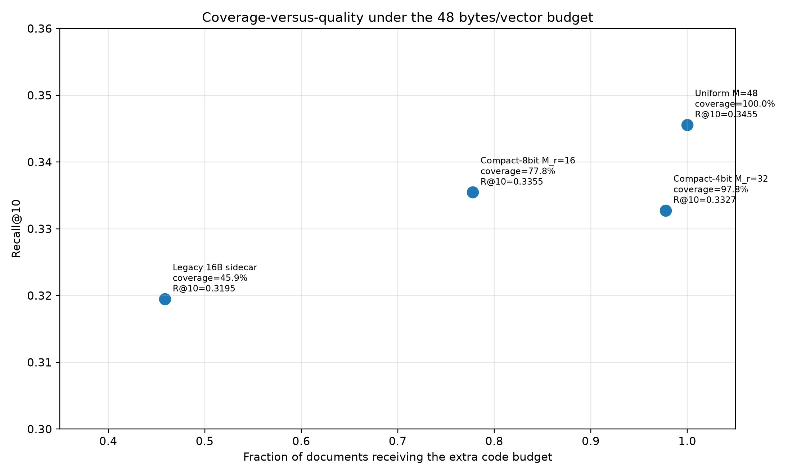
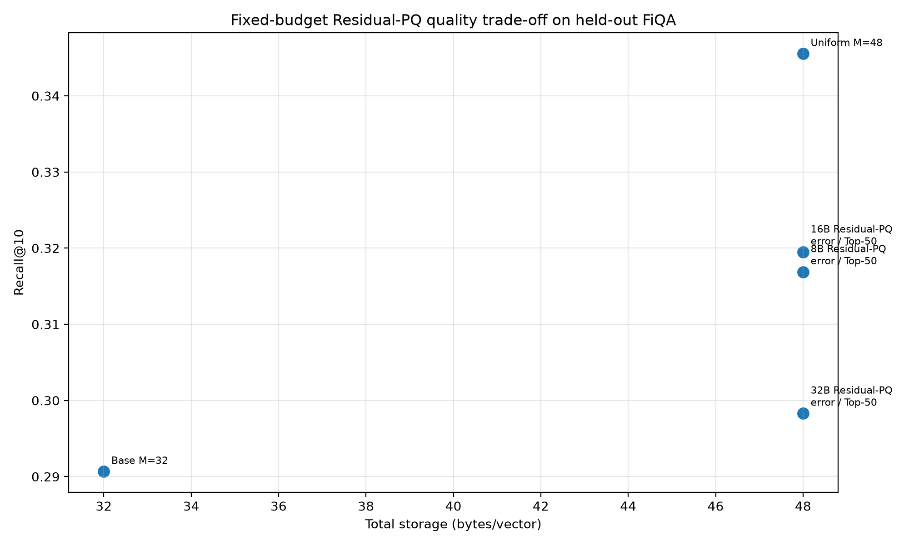
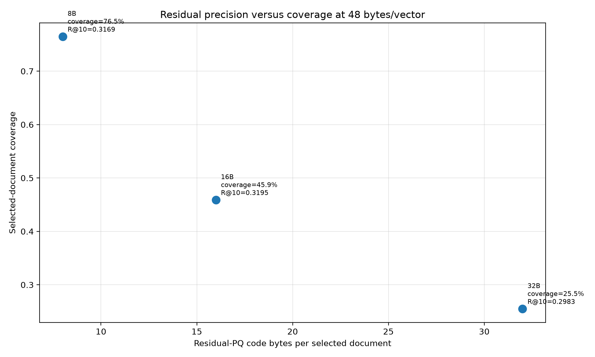
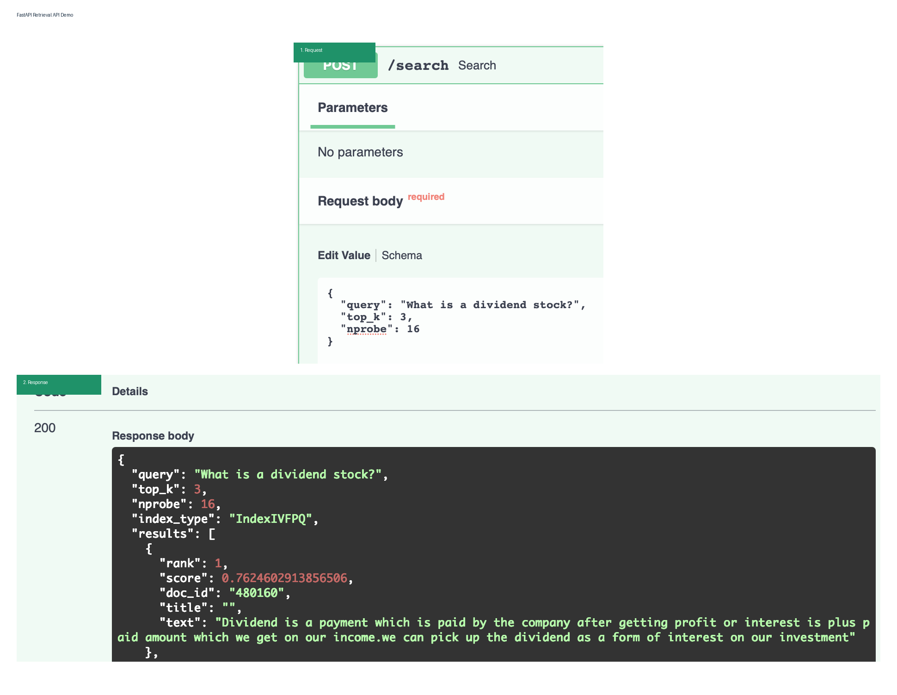

# AI Embedding Compression for RAG Retrieval

[](https://github.com/ravan-chuang/Embedding_Compression_for_RAG_Retrieval/actions/workflows/ci.yml)
[](LICENSE)
[](https://github.com/facebookresearch/faiss)
[](docs/docker_api.md)

A research-grade benchmark, frozen-index retrofit study, and deployable retrieval system for embedding compression and approximate nearest-neighbor search in Retrieval-Augmented Generation (RAG).

The repository separates three questions that are often conflated:

1. **Compression quality:** How much retrieval quality remains after document embeddings are compressed?
2. **Compressed-domain efficiency:** What latency and throughput are obtained when Faiss searches PQ codes directly?
3. **Frozen-index recovery:** How much ranking quality can be recovered by attaching a compact residual sidecar without rebuilding or rewriting an existing IVF-PQ index?

The current research focus is **lightweight post-hoc correction of quantization-induced Top-k loss in frozen IVF-PQ indexes**. The completed v1 evidence has three layers: a positive MS MARCO clean-pipeline result against the frozen base index, an unsupported preregistered TREC DL RARS-versus-PCA hypothesis, and a larger one-shot BEIR NQ confirmation that also does not support RARS superiority. The separately versioned v2.2 FP32 development replication ends `UNSTABLE_NO_QAT`, the v3 matched-access oracle ends `STOP_NO_HEADROOM`, and the v5 100K PQ-aware adapter pilot ends `STOP_PQ_AWARE_100K_PILOT`. The completed v6 diagnostic then establishes distributed 1M PQ-specific headroom, while the v7 query-only adapter still ends `STOP_V7_QUERY_ADAPTER_PILOT`. RARS-v8 is the resulting redesign: a deterministic, query-balanced, cutoff-aware rank-16 int8 document-residual sidecar with a storage-matched PCA comparator. Its frozen one-shot development run passes every registered gate and authorizes a separate prospective confirmation protocol; it is positive development evidence, not independent confirmation.

On that clean-pipeline held-out MS MARCO 1M test split, frozen RARS Top40 improves:

- Recall@10: `0.6833 → 0.7073` (`+0.0240`, 95% paired-bootstrap CI `[+0.0105, +0.0378]`)
- Success@10: `0.6910 → 0.7180` (`+0.0270`, CI `[+0.0130, +0.0410]`)
- MRR@10: `0.4722 → 0.4851` (`+0.0129`, CI `[+0.0030, +0.0229]`)
- nDCG@10: `0.5204 → 0.5360` (`+0.0156`, CI `[+0.0068, +0.0244]`)

All four confidence intervals are strictly above zero on the full 1,000-query clean-pipeline held-out split. A project-history audit subsequently found that 137 of those queries had appeared in an earlier exploratory query set. After excluding those 137 queries by ID, the remaining 863 prior-unseen queries retain statistically positive gains for Recall@10, Success@10, and nDCG@10; MRR@10 remains directionally positive but its 95% confidence interval narrowly crosses zero. The base IVF-PQ index and its existing PQ codes remain unchanged.

The later external comparison froze a storage-matched PCA sidecar and RARS before evaluating 42 eligible TREC DL 2019 queries against the same frozen 1M corpus. RARS minus PCA Recall@10 was `-0.0181`, with a 95% paired-bootstrap CI of `[-0.0735, +0.0168]`. The external primary hypothesis was therefore **not supported**. This 42-query result is a corpus-restricted sensitivity analysis, not an official full-corpus TREC benchmark, but it is the latest confirmatory evidence and is reported without retuning.

The subsequent full-corpus BEIR NQ confirmation fitted and selected both sidecars using NQ train queries before a one-shot evaluation on 3,452 official test queries. RARS minus PCA Recall@10 was `-0.000410`, with a 95% paired-bootstrap CI of `[-0.005987, +0.004972]`; neither sidecar improved Recall@10 over the frozen M32 base. A locked post-hoc diagnosis found substantial recoverable headroom from exact Top-40 candidate rescoring (`+0.08379` Recall@10 over base), while the exact-overlap proxy correlated only weakly with relevance gain (`r≈0.15` for RARS). These diagnostics motivated the now-completed, separately versioned RARS-v2.2 FP32 development replication; they do not authorize NQ test retuning.

On the same 1,019 MS MARCO inner-validation queries, held-out optimizer seeds 43 and 44 reach mean Recall@10 `0.714426`, a gain of `+0.021099` over Base and `+0.007687` over direct PCA. Both held-out paired-query bootstrap intervals have positive lower bounds. However, seed 44 improves only 10 queries over PCA, below the preregistered requirement of 11. The formal decision is therefore **`UNSTABLE_NO_QAT`**: the mean effect replicates, but the positive-query support is too sparse to authorize QAT.

The frozen RARS-v8 development run uses five-fold out-of-fold scoring on 2,307
`oracle_design` queries. Known-positive Recall@10 is `0.679923` for Base,
`0.692638` for the storage-matched PCA sidecar, and `0.702825` for RARS-v8.
RARS-v8 gains `+0.022901` over Base (95% paired-bootstrap CI
`[+0.014666, +0.031426]`) and `+0.010186` over PCA (CI
`[+0.003468, +0.017122]`), recovering `24.40%` of the same-candidate oracle
gap. All ten frozen development gates pass. The subsequent qrels-free builder
creates byte-audited 1M-document PCA and RARS sidecars at `16.025024 B/doc`
without changing the IVF-PQ index. The recorded optimization loss rises rather
than falls, so no loss-convergence claim is made; the positive result is limited
to recomputable OOF ranking metrics and still requires prospective confirmation.

That next step is now specified by the frozen
[RARS-v9 confirmation protocol](docs/rars_v9_locked_confirmation_protocol.md),
[machine-readable contract](protocols/rars_v9_locked_confirmation_v1.json), and
[clean Colab notebook](notebooks/MSMARCO_RARS_v9_Locked_Confirmation.ipynb).
V9 does not train or tune a new method. It first builds the 803-query identity
packet and a rebuilt M48 limitation baseline without qrels, freezes every input,
and then permits one outcome opening. Its sole primary endpoint is
RARS-v8-minus-PCA Recall@10; higher `nprobe`, M48, Base, and same-candidate exact
are locked comparators. The 803-query role is prospective relative to V8 but
came from the historical v2 development pool, so it is explicitly classified
as within-program confirmation, not independent evidence. V9 has not yet run.

## Current Evidence Summary

**As of 2026-07-22, the experiment sequence includes the audited RARS-v8
development and full-corpus sidecar packets.** V8 passes its frozen development
gate, but it has not undergone a separate prospective evaluation. The
appropriate review status remains **share with caveats** rather than
method-superiority ready.

The strongest defensible research claim is:

> A compact rank-16 int8 residual sidecar can recover part of the
> quantization-induced Top-k loss of an already deployed IVF-PQ index without
> changing its coarse quantizer, codebooks, inverted lists, or PQ codes.

The current evidence does **not** establish that RARS generally outperforms a
storage-matched PCA sidecar, OPQ, a rebuilt higher-rate PQ index, or exact
candidate reranking. It also does not establish a successful PQ-aware training
or query-adapter extension.

| Stage | Evaluation role | Primary outcome | Frozen decision |
|---|---|---|---|
| Fixed-budget residual-PQ refinement | FiQA exploratory | Best selective configuration remains below uniform M48 at comparable representation budget | Do not use as the main method |
| Exploratory RARS | MS MARCO 1M exploratory | Recall@10 `0.66275 → 0.69992`; useful for ablation, not confirmation | Superseded by clean split |
| Clean held-out RARS | MS MARCO 1M, 1,000 held-out queries | Recall@10 `0.68333 → 0.70733`, gain `+0.02400`, 95% CI `[+0.01050, +0.03783]` | RARS-over-Base supported |
| Cross-setting sidecar transfer | FiQA BGE / MiniLM | Recall@10 gains `+0.01311` / `+0.00962`; both intervals cross zero | Directional only |
| External RARS-versus-PCA | TREC DL 2019, 42 restricted-corpus queries | Recall@10 difference `-0.01812`, CI `[-0.07351, +0.01685]` | Primary hypothesis unsupported |
| Independent RARS-versus-PCA | BEIR NQ, 3,452 test queries | Recall@10 difference `-0.000410`, CI `[-0.005987, +0.004972]` | General-superiority claim rejected |
| RARS-v2 boundary loss | MS MARCO development | Five-epoch Recall@10 collapses to `0.38450` | Failed; protocol mismatch diagnosed |
| RARS-v2.1 deployable int8 | MS MARCO development | Boundary sidecar `0.67867` versus PCA `0.70433` | `NO_GO_OR_REVISE` |
| RARS-v2.2 FP32 replication | 1,019 inner-validation queries, seeds 42--44 | Held-out mean `+0.007687` over PCA, but seed 44 improves 10 queries versus required 11 | `UNSTABLE_NO_QAT` |
| RARS-v3 matched-access oracle | Development-only, non-deployable | Repaired exact rerun does not provide the preregistered allocator headroom | `STOP_NO_HEADROOM` |
| RARS-v5 PQ-aware 100K pilot | 728 selection queries | Recall@10 `-0.00206`; Recall@100 `+0.00275`; only 2 improved queries | `STOP_PQ_AWARE_100K_PILOT` |
| RARS-v6 1M headroom diagnostic | 2,307 design queries | Same-route FP32 gives `+0.04663` Recall@100 over Base-PQ; 4,413 flip triplets span 189 queries | `GO_TO_V6_LOSS_IMPLEMENTATION`; diagnostic only |
| RARS-v7 query adapter | 462 selection queries | Recall@10 `+0.00505`; Recall@100 `+0.00758`, CI crosses zero; cosine guardrail fails | `STOP_V7_QUERY_ADAPTER_PILOT` |
| RARS-v8 cutoff-aware sidecar | 2,307 design queries; five-fold OOF, int8-only | Recall@10 `0.67992 → 0.70282`; `+0.01019` over storage-matched PCA, CI `[+0.00347, +0.01712]`; all gates pass | `GO_TO_RARS_ALGORITHM_CONFIRMATION_PROTOCOL`; development only |
| RARS-v9 locked confirmation | 803 prospective-to-V8 queries; one-shot, not independent of the historical program | Protocol, qrels-free identity/M48 builders, evaluator, decision core, and notebook frozen; no outcome opened | Pending execution; no retuning authorized |

These rows are not a single leaderboard. They use different datasets, query
roles, candidate pools, and comparators. Development and selection results
must not be cited as independent confirmation.

Evidence completeness also varies by row. The clean MS MARCO, TREC, v2.2, v5,
and v8 aggregates have committed per-query or raw-array support. The audited
[V8 closure packet](results/rars_v8_cutoff_sidecar/README.md) includes all OOF
Recall vectors and exact registrations for the external 1M int8 codes. The BEIR
NQ primary result still lacks a committed machine-readable packet; v3 lacks a
local complete result packet; the durable v6 output remains external to the
repository and was reverified by the executed v7 notebook; and v7 currently
has notebook evidence without a committed closure packet. These gaps do not
change the reported decisions, but they must be closed before final paper-table
generation or artifact release.

## Research Status

| Area | Status |
|---|---|
| PQ / OPQ quality and GPU ADC benchmarking | Complete |
| MS MARCO 1M low-rate sweep | Complete |
| Frozen IVF-PQ residual sidecar | Complete |
| Clean query-level RARS train / validation / test protocol | Complete |
| Clean-pipeline held-out RARS evaluation and audit manifest | Complete |
| Storage-matched PCA comparator and validation freeze | Complete |
| Preregistered external RARS-versus-PCA evaluation | Complete; primary hypothesis unsupported |
| External query-level and rank-flip diagnostics | Complete; post-hoc and non-tuning |
| Larger independent BEIR NQ confirmation | Complete on 3,452 queries; RARS-over-PCA primary hypothesis unsupported; no retuning |
| Post-hoc NQ sidecar diagnosis | Complete; exact Top-40 has material headroom, proxy/relevance alignment is weak |
| RARS-v2 boundary-loss feasibility | Superseded by the completed v2.2 FP32 development replication; closed NQ test remains prohibited |
| RARS-v2.2 FP32 development replication | [Development protocol](docs/rars_v2_2_boundary_loss_protocol.md), [replication protocol](docs/rars_v2_2_fp32_replication_protocol.md), [replication notebook](notebooks/MSMARCO_RARS_v2_2_FP32_Replication.ipynb), and [closure packet](results/rars_v2_2_fp32_replication/README.md) complete. Held-out seeds 43/44 reach mean Recall@10 `0.714426` (`+0.021099` vs Base; `+0.007687` vs direct PCA), but seed 44 has 10 improved queries vs the required 11; formal decision `UNSTABLE_NO_QAT`, and QAT is not authorized. |
| RARS-v3 oracle-first matched-access feasibility | [Frozen protocol](docs/rars_v3_oracle_first_feasibility_protocol.md), [machine-readable contract](protocols/rars_v3_oracle_first_feasibility_v1.json), and [commit-pinned notebook](notebooks/MSMARCO_RARS_v3_Oracle_First_Feasibility.ipynb) are complete. After the [documented pre-audit implementation repair](docs/rars_v3_pre_audit_implementation_repair.md), the exact rerun ended `STOP_NO_HEADROOM`; no static-storage allocator or training stage was authorized. This is a non-deployable, development-only gate and cannot support a persistent-storage claim. |
| RARS-v5 PQ-aware 100K pilot | [Frozen development protocol](docs/rars_v5_pq_aware_100k_pilot_protocol.md), [machine-readable contract](protocols/rars_v5_pq_aware_100k_pilot_v1.json), [commit-pinned Colab notebook](notebooks/MSMARCO_RARS_v5_PQ_Aware_100K_Pilot.ipynb), and [audited closure packet](results/rars_v5_pq_aware_100k_pilot/README.md) are complete. The rank-8 hard-PQ adapter changes known-positive Recall@100 from `0.975275` to `0.978022` (`+0.002747`, 95% CI `[0, +0.006868]`) but improves only 2 of 728 queries and slightly exceeds the Recall@10 loss guardrail. Formal decision: `STOP_PQ_AWARE_100K_PILOT`. Seeds 43/44, RARS combination, a 1M rebuild, external evaluation, and the 803-query future role are not authorized. |
| RARS-v6 1M PQ-specific headroom diagnostic | [Frozen diagnostic protocol](docs/rars_v6_1m_headroom_protocol.md), [machine-readable contract](protocols/rars_v6_1m_headroom_v1.json), and commit-pinned Colab run are complete. On 2,307 `oracle_design` queries, Base-PQ Recall@100 is `0.84731`, same-route FP32 Recall@100 is `0.89395`, and 4,413 uncapped PQ-induced flip triplets span 189 queries. All six preregistered gates pass; formal decision `GO_TO_V6_LOSS_IMPLEMENTATION`. This is a development diagnostic, not a method result or independent confirmation. |
| RARS-v7 frozen-index query-adapter pilot | [Frozen protocol](docs/rars_v7_query_adapter_pilot_protocol.md), [machine-readable contract](protocols/rars_v7_query_adapter_pilot_v1.json), and [commit-pinned notebook](notebooks/MSMARCO_RARS_v7_Query_Adapter_Pilot.ipynb) are complete. The query-only adapter changes selection Recall@10 from `0.65657` to `0.66162` and Recall@100 from `0.84957` to `0.85714`, but its Recall@100 95% CI is `[-0.00433, +0.02056]`, gap recovery is `13.46%`, and mean query cosine is `0.94682`. Formal decision: `STOP_V7_QUERY_ADAPTER_PILOT`. |
| RARS-v8 cutoff-aware frozen-index sidecar | [Frozen development protocol](docs/rars_v8_cutoff_sidecar_protocol.md), [machine-readable contract](protocols/rars_v8_cutoff_sidecar_v1.json), [commit-pinned Colab notebook](notebooks/MSMARCO_RARS_v8_Cutoff_Sidecar_Development.ipynb), and [audited closure packet](results/rars_v8_cutoff_sidecar/README.md) are complete. On 2,307 design queries, five-fold OOF RARS-v8 Recall@10 is `0.702825` versus Base `0.679923` and storage-matched PCA `0.692638`; all development gates pass and the formal decision is `GO_TO_RARS_ALGORITHM_CONFIRMATION_PROTOCOL`. The qrels-free builder creates both 1M sidecars at `16.025024 B/doc` with a byte-identical IVF-PQ index. The optimizer's recorded surrogate loss rises, and no independent confirmation or loss-convergence claim is made. |
| RARS-v9 locked confirmation | [Frozen protocol](docs/rars_v9_locked_confirmation_protocol.md), [machine-readable contract](protocols/rars_v9_locked_confirmation_v1.json), [source-hash-pinned Colab notebook](notebooks/MSMARCO_RARS_v9_Locked_Confirmation.ipynb), qrels-free future-identity builder, qrels-free M48 builder, and one-shot evaluator are complete but unexecuted. The primary endpoint is RARS-v8 minus PCA Recall@10. The 803-query role is prospective relative to V8 but historically descended from v2 `inner_train`; it must not be called independent. |
| Deployable rank-16 int8 sidecar artifact | Complete |
| FastAPI sidecar serving path | Complete |
| Artifact-backed and live-Faiss benchmarks | Complete |
| Paper-ready CSV / LaTeX table pipeline | Complete for committed source packets, including the v2.2 development closure table; the BEIR NQ primary result still lacks a committed machine-readable result packet |
| SIGIR short-paper manuscript | [Draft v2](docs/rars_paper_draft_v2.md) includes the v2.2 closure and reframes the mixed evidence; final four-page typesetting remains pending |

## Highlights

- Evaluates Float32, INT8, INT4, PQ, OPQ, IVF-PQ, and OPQ-IVF-PQ across FiQA, SciFact, and a deterministic 1M-passage MS MARCO benchmark.
- Measures Recall@5, Recall@10, Success@10, MRR@10, nDCG@10, serialized storage, analytical code size, latency, and QPS.
- Implements genuine compressed-domain GPU retrieval with Faiss IVF-PQ ADC; document vectors are not reconstructed to Float32 during ANN search.
- Provides a complete low-rate MS MARCO 1M sweep over `M ∈ {24, 32, 48, 64, 96}` and `nprobe ∈ {4, 16, 32, 64}`.
- Introduces a frozen-index rank-16 int8 residual sidecar that requires no retraining of the coarse quantizer and no rewrite of existing PQ codes.
- Adds a leakage-resistant RARS protocol with deterministic `4,980 / 1,000 / 1,000` train, validation, and clean-pipeline held-out query splits.
- Fits the score-error weighted residual basis on train queries only, selects `alpha=0.75` and Top40 on validation only, freezes the configuration in Git, and then performs a one-shot clean-pipeline held-out evaluation.
- Improves clean-pipeline held-out Recall@10 from `0.6833` to `0.7073`; all four paired-bootstrap confidence intervals are above zero on the full 1,000-query split. After excluding 137 queries used in earlier exploratory work, Recall@10 improves from `0.6956` to `0.7124` (`+0.0168`, 95% CI `[+0.0029, +0.0303]`).
- Freezes an ordinary unweighted rank-16 int8 PCA comparator under the same candidate pool, correction depth, selection rule, and storage budget as RARS.
- Reports the negative preregistered external result without retuning: on 42 eligible TREC DL 2019 queries restricted to the frozen 1M corpus, RARS minus PCA Recall@10 is `-0.0181` with 95% CI `[-0.0735, +0.0168]`.
- Preserves the completed v2.2 FP32 replication without post-hoc rescue: the held-out-seed mean gain over direct PCA is `+0.007687`, but seed 44 misses the frozen positive-support gate by one query, so the formal decision is `UNSTABLE_NO_QAT` and no QAT stage is run.
- Separates routing loss from PQ-specific loss on the V6 1M design role: Base-PQ Recall@100 is `0.84731`, same-route FP32 Recall@100 is `0.89395`, and full exact Recall@100 is `0.97298`. The PQ-specific gap is real but accounts for only `37.11%` of the total Base-to-exact gap.
- Records the V7 query-only adapter as a stopped negative pilot: its small Recall gains are not statistically supported, gap recovery is only `13.46%`, and mean query cosine `0.94682` violates the preregistered `0.995` drift guardrail.
- Completes V8 exactly as frozen: five-fold OOF Recall@10 improves by `+0.022901` over Base and `+0.010186` over storage-matched PCA, both with positive paired-bootstrap lower bounds. The separate qrels-free builder produces audited 1M-document PCA and RARS artifacts without changing the IVF-PQ index. This is development evidence awaiting prospective confirmation; the rising recorded surrogate loss is disclosed.
- Freezes V9 before any 803-query outcome access: source and artifact hashes, one primary endpoint, paired bootstrap, paired randomization test, breadth/harm gates, higher-`nprobe` alternatives, and a qrels-free same-code-budget M48 rebuild are fixed. The evaluator writes durable input/start markers before parsing qrels and never authorizes post-hoc tuning.
- Packages the 1M-document RARS sidecar with a `16.025 B/document` residual-representation cost and `24.028 B/document` complete artifact cost including external document IDs.
- Adds vectorized live-Faiss correction; the previously recorded 14-thread Top40 implementation requires `1.325 µs/query`, equal to `4.41%` of independently timed Faiss search cost. These timing measurements come from the earlier artifact benchmark and are reported separately from the clean-split quality result.
- Verifies clean-split artifacts with SHA-256 hashes for the selected configuration, basis, scales, evaluator inputs, test results, and per-query outputs.
- Adds FastAPI `/search`, `/batch-search`, and `/health` support for optional fixed Top-B RARS correction.
- Retains negative results rather than hiding them: the external RARS-over-PCA hypothesis is unsupported, higher-rate `M=48` remains stronger when rebuilding is allowed, FiQA transfer is model-sensitive, learned routers do not beat fixed-depth correction, and the evaluated cross-encoder reranker does not justify its latency.

## Benchmark Setup

| Item | Configuration |
|---|---|
| Primary benchmark | FiQA / BEIR |
| FiQA corpus / queries | 57,638 documents / 648 queries |
| Cross-dataset validation | SciFact / BEIR: 5,183 documents / 300 queries |
| Million-scale validation | Deterministic MS MARCO subset: 1,000,000 passages / 6,980 dev queries |
| Primary deployment model | `sentence-transformers/all-MiniLM-L6-v2` |
| Cross-model validation | `BAAI/bge-small-en-v1.5` |
| Embedding dimension | 384 for both evaluated models |
| Retrieval metrics | Recall@5, Recall@10, MRR@10, nDCG@10 |
| ANN backend | Faiss GPU IVF-PQ ADC |
| GPU | NVIDIA Tesla T4 |
| IVF configuration | FiQA / SciFact reference benchmarks: `nlist=256`; MS MARCO high-rate sweep: `nlist=4096`; frozen-index sidecar / RARS study: `nlist=512`; representative `nprobe=16` |

## Methods

### Reconstructed-vector quality evaluation

These methods compress document vectors, reconstruct dense vectors, then evaluate retrieval quality with dense GPU search:

- Float32 baseline
- INT8 scalar quantization
- INT4 scalar quantization
- Product Quantization (PQ)
- Optimized Product Quantization (OPQ) + PQ

This mode evaluates compression distortion and ranking preservation. It does **not** claim compressed-domain search acceleration.

### Compressed-domain GPU ANN evaluation

These methods use Faiss GPU indexes directly:

- `GpuIndexFlatIP`: exact Float32 dense retrieval baseline
- `GpuIndexIVFPQ`: compressed-domain IVF-PQ ADC retrieval
- PyTorch-learned OPQ rotation + `GpuIndexIVFPQ`
- Native Faiss `OPQMatrix` + `GpuIndexIVFPQ` comparison

For IVF-PQ, document vectors remain encoded as PQ codes during search. Faiss uses asymmetric distance computation (ADC) rather than reconstructing every document embedding.

## Main GPU ADC Quality Results

| Method | nprobe | Analytical compression | Serialized deployment compression | Recall@10 | nDCG@10 |
|:--|--:|--:|--:|--:|--:|
| GPU Float32 FlatIP | – | 1.00× | 1.00× | 0.4413 | 0.3687 |
| PyTorch OPQ-IVF-PQ M=96 | 16 | 13.59× | 12.01× | 0.4081 | 0.3462 |
| IVF-PQ M=96 | 16 | 14.94× | 13.05× | 0.4085 | 0.3442 |
| PyTorch OPQ-IVF-PQ M=96 | 64 | 13.59× | 12.01× | 0.4216 | 0.3548 |

At the deployed `M=96, nprobe=16` configuration, PyTorch OPQ-IVF-PQ retains about **92.5%** of Float32 Recall@10 and **93.9%** of Float32 nDCG@10 while reducing serialized deployment storage by about **12.01×**.

The serialized deployment figure includes the external `384 × 384` FP32 query-side OPQ rotation matrix. The analytical compression figure describes the index coding budget only.

## Cross-Dataset Validation: SciFact / BEIR

To test whether the FiQA trade-off is specific to a single financial-QA corpus, the same embedding model and ANN configuration were evaluated on SciFact / BEIR.

| Method | `nprobe` | Serialized deployment compression | Recall@10 | nDCG@10 |
|:--|--:|--:|--:|--:|
| GPU Float32 FlatIP | – | 1.00× | 0.7833 | 0.6451 |
| IVF-PQ M=96 | 16 | 6.00× | 0.7206 | 0.5975 |
| PyTorch OPQ-IVF-PQ M=96 | 16 | 4.15× | 0.7056 | 0.5906 |
| Native Faiss OPQMatrix-IVF-PQ M=96 | 16 | 4.15× | 0.7156 | 0.5969 |

The SciFact experiment uses 5,183 documents and 300 judged queries. At `M=96, nprobe=16`, the strongest OPQ baseline was the native Faiss `OPQMatrix` configuration, while plain IVF-PQ slightly outperformed the PyTorch-learned OPQ variant on Recall@10 and nDCG@10.

This is evidence of **cross-dataset evaluation**, not a claim that one OPQ implementation universally wins. The relative OPQ benefit is dataset-dependent, and SciFact is too small to support a million-scale ANN speed claim.

### Why SciFact serialized OPQ compression is lower

The lower SciFact serialized deployment compression ratio is expected and is not a PQ regression.

For OPQ serving, total deployment storage includes both the Faiss index and the fixed-size external query transform:

```text
total deployment bytes
= serialized Faiss index bytes
+ 384 × 384 FP32 OPQ rotation matrix bytes
```

The FP32 rotation matrix has the same size for MiniLM and BGE-small because both use 384-dimensional embeddings. Its storage cost is therefore nearly fixed across datasets, while the index size grows with the number of document vectors.

- **FiQA:** 57,638 documents. The fixed rotation overhead is amortized across a much larger index, so the OPQ artifact reaches about **12.01×** serialized deployment compression.
- **SciFact:** 5,183 documents. The index is much smaller, so the same rotation matrix becomes a material share of total artifact storage and lowers serialized deployment compression to about **4.15×**.

The analytical compression ratio still describes the index coding budget. The serialized ratio is intentionally stricter because it represents the actual bytes required to deploy a correct OPQ service.


## Million-Scale Validation: MS MARCO 1M

To test whether the observed compression and ANN trade-offs remain useful beyond small BEIR corpora, the project includes a deterministic **1,000,000-passage MS MARCO** benchmark using `BAAI/bge-small-en-v1.5` embeddings and a Tesla T4 GPU.

### Setup

| Item | Configuration |
|---|---|
| Corpus | 1,000,000 deterministic MS MARCO passages |
| Queries | 6,980 MS MARCO dev queries |
| Embedding model | `BAAI/bge-small-en-v1.5` |
| Embedding dimension | 384 |
| IVF configuration | `nlist=4096` |
| PQ configuration | `M=96`, `nbits=8`, FP16 lookup tables |
| OPQ configuration | Native Faiss `OPQMatrix`, `niter=50`, `niter_pq=4` |
| GPU | NVIDIA Tesla T4 |

### Main Results

| Method | `nprobe` | Recall@10 | MRR@10 | nDCG@10 | P95 search latency | QPS | Serialized deployment compression |
|:--|--:|--:|--:|--:|--:|--:|--:|
| GPU FlatIP exact | – | 0.8563 | 0.6370 | 0.6870 | 0.428 ms | 2,418 | 1.00× |
| IVF-PQ M=96 | 16 | 0.7195 | 0.5361 | 0.5770 | 0.024 ms | 47,147 | 13.01× |
| IVF-PQ M=96 | 32 | 0.7596 | 0.5619 | 0.6064 | 0.039 ms | 27,328 | 13.01× |
| IVF-PQ M=96 | 64 | 0.7887 | 0.5834 | 0.6297 | 0.072 ms | 14,619 | 13.01× |
| Native Faiss OPQMatrix + IVF-PQ M=96 | 64 | 0.7895 | 0.5842 | 0.6304 | 0.072 ms | 14,712 | 12.94× |

### Deployment-Aware Interpretation

At `M=96, nprobe=64`, plain IVF-PQ retains **92.1%** of exact Recall@10 while reducing serialized deployment storage by **13.01×**.

Native Faiss OPQ produces only a marginal gain at this high-rate configuration:

- Recall@10: `0.7887 → 0.7895` (`+0.0008`)
- nDCG@10: `0.6297 → 0.6304` (`+0.0008`)
- Build time: `17.8 s → 2,168.7 s` (`~122.1×` longer)

This suggests that when 384-dimensional embeddings are split into 96 PQ subvectors of only 4 dimensions each, plain IVF-PQ is already highly expressive and OPQ has limited remaining quantization error to remove.

The practical default at this scale is therefore plain IVF-PQ at `M=96, nprobe=32`, while `nprobe=64` is the higher-recall serving mode. Native OPQ remains an important baseline, especially for lower-rate PQ settings where rotation may provide more value.

> The table above is the `M=96` reference operating point from the completed low-rate sweep. Timing measures GPU Faiss search only and excludes embedding generation, HTTP transport, artifact loading, and response serialization.

## Low-Rate PQ / OPQ Full Sweep: MS MARCO 1M

A deployment-aware full sweep evaluates plain GPU IVF-PQ against native Faiss
`OPQMatrix` + GPU IVF-PQ on the deterministic 1,000,000-passage MS MARCO subset.

| Setting | Value |
|---|---|
| Embedding model | `BAAI/bge-small-en-v1.5` |
| Embedding dimension | 384 |
| IVF `nlist` | 4096 |
| PQ `nbits` | 8 |
| `M` values | 24, 32, 48, 64, 96 |
| `nprobe` values | 4, 16, 32, 64 |
| Total benchmark points | 40 |

The merged result set combines the `M=24/48` run and the `M=32/64/96`
continuation. The available recorded metadata was checked for consistency before
merging.

### OPQ incremental value at `nprobe=64`

| M | Plain Recall@10 | OPQ Recall@10 | Δ Recall@10 | Plain build | OPQ build | Build multiplier |
|---:|---:|---:|---:|---:|---:|---:|
| 24 | 0.6494 | 0.6880 | **+0.0386** | 9.9 s | 550.9 s | 55.8× |
| 32 | 0.6957 | 0.7226 | **+0.0269** | 10.3 s | 863.0 s | 83.6× |
| 48 | 0.7489 | 0.7609 | **+0.0120** | 12.6 s | 1162.7 s | 92.6× |
| 64 | 0.7729 | 0.7752 | **+0.0023** | 12.9 s | 1575.3 s | 122.2× |
| 96 | 0.7887 | 0.7895 | **+0.0008** | 17.8 s | 2168.7 s | 122.1× |

The sweep shows a clear rate-dependent transition: native OPQ provides its
largest retrieval-quality recovery at lower code rates (`M=24–32`), the gain
contracts at `M=48`, and it becomes practically negligible by `M=64–96`.
The OPQ transform adds little serialized storage at this corpus size, but its
offline training and index-build cost rises sharply.

This is a configuration-specific result for this corpus, model, IVF setting,
GPU environment, and evaluation workload. It is not a universal recommendation
to use or avoid OPQ.

Detailed outputs:
[full summary CSV](results/msmarco_low_rate_pareto/1m_full_m24_m96/msmarco_1m_low_rate_pq_opq_full_summary.csv),
[artifact accounting](results/msmarco_low_rate_pareto/1m_full_m24_m96/msmarco_1m_low_rate_pq_opq_full_artifacts.csv),
[merged metadata](results/msmarco_low_rate_pareto/1m_full_m24_m96/msmarco_1m_low_rate_pq_opq_full_metadata.json),
and [full report](results/msmarco_low_rate_pareto/1m_full_m24_m96/msmarco_1m_low_rate_pq_opq_full_report.md).

### Low-rate quality-storage Pareto frontier



### Low-rate quality-throughput Pareto frontier




## Frozen IVF-PQ PQ-Residual Sidecar: 1M Retrofit Study

This study evaluates a separate **frozen-index retrofit** mechanism. It is distinct
from the fixed-budget Residual-PQ experiments below: the original IVF-PQ index,
coarse quantizer, and PQ codes are left unchanged. A compact sidecar stores an
approximation of the error between the original embedding and the vector
reconstructed from that fixed IVF-PQ index.

### Motivation

A deployed ANN index may be expensive or operationally risky to rebuild. The
sidecar asks a narrower systems question:

> Can a frozen IVF-PQ index recover part of its ranking loss by attaching a
> small, separately stored correction payload, without retraining the index or
> rewriting its existing PQ codes?

For document embedding \(x\) and the reconstruction \(\hat{x}_{\mathrm{PQ}}\)
returned by the frozen IVF-PQ representation, the sidecar models:

```text
r_PQ(x) = x - x_hat_PQ
```

A shared rank-16 PCA basis is fit to these residuals. Each document stores only
16 per-dimension int8 coefficients. At query time, the system computes a
low-rank correction for only the highest-ranked ANN candidates:

```text
corrected_score(q, x)
= IVF-PQ_score(q, x)
+ alpha · q · r_hat_PQ(x)
```

The full-1M experiment freezes `alpha=1.0` and corrects only the top-40
documents from a Top-100 IVF-PQ candidate pool.

### Full 1M protocol

| Item | Configuration |
|---|---|
| Corpus | 1,000,000 deterministic MS MARCO passages |
| Evaluation queries | 1,000 frozen MS MARCO dev-query split |
| Embedding model | `BAAI/bge-small-en-v1.5` |
| Embedding dimension | 384 |
| Base index | IVF-PQ, `nlist=512`, `M=32`, `nbits=8`, `nprobe=16` |
| Candidate pool | Top-100 |
| Final cutoff | Top-10 |
| Sidecar | Rank-16 PCA residual basis + per-dimension int8 coefficients |
| Sidecar payload | 16 bytes/document |
| Activated candidates | Top-40 ANN candidates |
| Statistical test | Paired bootstrap, 20,000 resamples |
| GPU | NVIDIA Tesla T4 |

The `nlist=512`, `M=32` configuration is a deliberate low-rate retrofit
operating point. It is separate from the `M=96`, `nlist=4096` quality-throughput
reference sweep reported earlier.

### Main full-1M retrieval result

| Method | Recall@10 | Success@10 |
|:--|--:|--:|
| Frozen IVF-PQ `M=32` | 0.6628 | 0.6740 |
| **Frozen IVF-PQ `M=32` + rank-16 int8 PQ-residual sidecar** | **0.6914** | **0.7010** |
| Oracle exact rerank within the same IVF-PQ Top-100 candidate pool | 0.7792 | 0.7870 |

The sidecar improves Recall@10 by **+0.0287**. A paired bootstrap over the
1,000 frozen evaluation queries gives a 95% confidence interval of
**[+0.0147, +0.0430]**; none of 20,000 bootstrap resamples has a non-positive
mean gain.

The oracle row is a **candidate-pool ceiling** only: it rescored the 100
documents already returned by IVF-PQ with exact Float32 inner products. It is
not a full-corpus exact-search result.

Per-query Recall@10 changes were concentrated near ranking cutoffs:

```text
positive-gain queries: 44
unchanged queries:     941
negative-gain queries: 15
```

### Storage and retrofit properties

| Artifact | Size / requirement |
|---|---:|
| Frozen IVF-PQ `M=32` serialized index | 39.276 MB |
| Int8 sidecar codes for 1M documents | 15.259 MB |
| Shared rank-16 FP32 basis | 24.125 KB |
| Per-dimension scales | 192 bytes on disk |
| Added payload | 16 bytes/document |
| IVF-PQ retraining required for upgrade | No |
| Re-encoding existing PQ codes required | No |
| Original embeddings required to build the sidecar | Yes |

The retrofit computes residuals from the original embeddings and the frozen
index reconstruction, then writes a separate sidecar. It does not modify the
existing IVF coarse quantizer, codebooks, inverted lists, or PQ codes.

### Quality-storage comparison

| Method | PQ bytes/doc | Sidecar bytes/doc | Total representation bytes/doc | Recall@10 | Success@10 |
|:--|--:|--:|--:|--:|--:|
| IVF-PQ `M=16` | 16 | 0 | 16 | 0.5423 | 0.5540 |
| IVF-PQ `M=16` + rank-16 sidecar | 16 | 16 | 32 | 0.5799 | 0.5920 |
| IVF-PQ `M=32` | 32 | 0 | 32 | 0.6628 | 0.6740 |
| IVF-PQ `M=32` + rank-16 sidecar | 32 | 16 | 48 | 0.6914 | 0.7010 |
| IVF-PQ `M=48` | 48 | 0 | 48 | 0.7311 | 0.7410 |

The sidecar substantially improves a fixed base index, but it does **not**
outperform simply increasing the PQ code rate under an equal total
representation-byte budget. For example, `M=32 + 16B sidecar` remains below
the 48-byte `M=48` baseline.

The appropriate claim is therefore a **frozen-index enhancement / retrofit**
path, not a replacement for larger PQ codes when a full index rebuild is
acceptable.

### GPU-resident correction latency

The sidecar was moved to GPU memory and evaluated with a batch size of 64 on a
Tesla T4. The GPU implementation matched the CPU prototype exactly
(maximum correction difference `9.31e-09`; Top-10 row agreement `100%`).

| Stage | P50 ms/query | P95 ms/query |
|:--|--:|--:|
| IVF-PQ search | 0.0545 | 0.0885 |
| GPU sidecar correction + Top-40 rerank | 0.0168 | 0.0413 |
| Combined retrieval pipeline | 0.0797 | 0.1174 |

These timings exclude embedding generation, HTTP transport, artifact loading,
and response serialization. The current implementation uses Python
orchestration: Faiss returns candidate arrays to Python before PyTorch performs
GPU-side correction and reranking. It is therefore a batched GPU prototype,
not a fused CUDA serving kernel or a single-query production tail-latency claim.

### Interpretation

The result establishes that a compact low-rank sidecar can recover a
statistically significant portion of the ranking loss of a frozen low-rate
IVF-PQ index:

- **Recall gain:** `0.6628 → 0.6914` on the frozen 1M evaluation split.
- **Candidate-pool oracle-gap recovery:** `24.62%`.
- **Storage overhead:** 16 bytes/document.
- **Correction scope:** only Top-40 retrieved candidates.
- **Upgrade path:** no IVF-PQ retraining and no PQ code rewrite.

It does not establish that the sidecar is globally storage-optimal versus a
newly trained, higher-rate IVF-PQ index. That negative result is retained as
an important deployment-aware limitation.


## Cross-Setting Validation: Frozen PQ-Residual Sidecar

The 1M MS MARCO result establishes the main system-scale result. To test whether
its direction transfers beyond a single corpus-model setting, the same frozen
sidecar protocol was evaluated on FiQA / BEIR with both BGE-small and MiniLM.
The FiQA runs use the **same sidecar hyperparameters selected on MS MARCO**;
the only corpus-scale adjustment is `nlist=256` for the smaller FiQA corpus.

### Shared protocol

| Item | MS MARCO 1M | FiQA / BEIR |
|---|---:|---:|
| Base ANN index | IVF-PQ `M=32`, `nbits=8` | IVF-PQ `M=32`, `nbits=8` |
| IVF setting | `nlist=512`, `nprobe=16` | `nlist=256`, `nprobe=16` |
| Candidate pool | Top-100 | Top-100 |
| Sidecar | rank-16 PCA basis + int8 coefficients | rank-16 PCA basis + int8 coefficients |
| Sidecar payload | 16 B/document | 16 B/document |
| Activated candidates | Top-40 | Top-40 |
| Score fusion | `alpha=1.0` | `alpha=1.0` |
| Final cutoff | Top-10 | Top-10 |
| Statistical test | paired bootstrap, 20,000 resamples | paired bootstrap, 20,000 resamples |

The FiQA transfer experiments do **not** retune rank, code width, candidate
depth, or `alpha` after observing FiQA results.

### Cross-setting Recall@10 results

| Setting | Frozen IVF-PQ `M=32` | `M=32` + rank-16 sidecar | IVF-PQ `M=48` | Sidecar gain |
|:--|--:|--:|--:|--:|
| MS MARCO 1M × BGE-small | 0.6628 | **0.6914** | **0.7311** | **+0.0287** |
| FiQA × BGE-small | 0.3287 | **0.3418** | **0.3896** | **+0.0131** |
| FiQA × MiniLM | 0.3358 | **0.3454** | **0.3723** | **+0.0096** |



Across all three settings, the sidecar improves the frozen `M=32` index. The
same-storage `M=48` baseline remains stronger in all three cases, reinforcing
the intended positioning: the method is a **retrofit enhancement for an
existing index**, not a replacement for retraining a higher-rate PQ index when
a full rebuild is acceptable.

### Paired-bootstrap interpretation

| Setting | Recall@10 gain | 95% paired-bootstrap CI | Bootstrap fraction with gain ≤ 0 | Interpretation |
|:--|--:|--:|--:|:--|
| MS MARCO 1M × BGE-small | +0.0287 | [+0.0147, +0.0430] | 0.0000 | Statistically positive on the frozen 1,000-query evaluation split |
| FiQA × BGE-small | +0.0131 | [-0.0006, +0.0268] | 0.0303 | Positive zero-retuning point estimate; interval marginally crosses zero |
| FiQA × MiniLM | +0.0096 | [-0.0056, +0.0252] | 0.1129 | Positive zero-retuning point estimate; interval crosses zero |



The correct interpretation is deliberately conservative: the sidecar's
improvement direction is consistent across corpus and embedding-model settings,
while the strongest statistical evidence currently comes from the 1M MS MARCO
experiment. The smaller 648-query FiQA evaluations provide transfer evidence,
but do not establish a universally significant gain at the 95% confidence level.

### Candidate-pool recovery

The exact-rescoring oracle reranks only documents already present in the frozen
`M=32` Top-100 candidate pool. It measures recoverable ranking error within the
candidate pool, not full-corpus exact-search quality.

| Setting | Frozen `M=32` | Exact Top-100 candidate oracle | Recoverable Recall@10 gap | Sidecar recovery of oracle gap |
|:--|--:|--:|--:|--:|
| MS MARCO 1M × BGE-small | 0.6628 | 0.7792 | +0.1164 | 24.62% |
| FiQA × BGE-small | 0.3287 | 0.4306 | +0.1020 | 12.86% |
| FiQA × MiniLM | 0.3358 | 0.4114 | +0.0756 | 12.72% |

### Reproducible result package

The committed result package contains the flat table, structured per-setting
metadata, bootstrap summaries, figures, and a SHA-256 manifest:

- [cross-setting summary](results/pq_residual_sidecar_cross_setting/cross_setting_summary.json)
- [summary CSV](results/pq_residual_sidecar_cross_setting/cross_setting_summary.csv)
- [summary JSON](results/pq_residual_sidecar_cross_setting/cross_setting_summary.json)
- [per-setting metadata](results/pq_residual_sidecar_cross_setting/setting_details/)
- [integrity manifest](results/pq_residual_sidecar_cross_setting/manifest.json)


## Retrieval-Aware Residual Subspace (RARS)

The PCA sidecar captures residual variance in

```text
r_PQ(x) = x - x_hat_PQ
```

but does not directly prioritize residual directions that matter for candidate-score errors. RARS replaces the reconstruction-oriented basis with a retrieval-aware weighted residual basis while preserving the same frozen-index correction form:

```text
s_corr(q, x)
= s_IVFPQ(q, x)
+ alpha · q^T B a_x
```

`B` is a rank-16 basis and `a_x` is the per-document int8 coefficient vector. The frozen IVF-PQ index, coarse quantizer, codebooks, inverted lists, and existing PQ codes are not rewritten.

### Clean query-level protocol

The original exploratory notebook reused the same 1,000-query set for weighted-basis fitting, alpha / depth selection, and qrels reporting. That result was useful for method development but was not a clean held-out estimate.

The corrected protocol uses all 6,980 available MS MARCO dev queries with deterministic, non-overlapping query splits:

| Split | Queries | Permitted use |
|---|---:|---|
| Train | 4,980 | Candidate-score error construction and weighted-basis fitting |
| Validation | 1,000 | Basis, alpha, and correction-depth selection |
| Clean-pipeline held-out test | 1,000 | One-shot final qrels evaluation only |

Additional safeguards:

- query IDs are mapped to the fixed `(6980, 384)` query-vector rows;
- all three split intersections are empty;
- the source ordered query-ID mapping is recorded by SHA-256;
- the selected configuration was committed before the test evaluator was run;
- the test evaluator contains no SVD, fitting, alpha sweep, Top-B sweep, or validation loading;
- the final output records hashes for the evaluator, test split, qrels, index, query vectors, document IDs, basis, scales, codes, metrics, and per-query results.

### Frozen configuration

| Item | Frozen value |
|---|---|
| Corpus | 1,000,000 deterministic MS MARCO passages |
| Embedding model | `BAAI/bge-small-en-v1.5` |
| Embedding dimension | 384 |
| Base index | IVF-PQ `M=32`, `nbits=8`, `nlist=512`, `nprobe=16` |
| Candidate pool | Top-100 |
| Final cutoff | Top-10 |
| Sidecar | Rank-16, per-dimension int8 |
| Basis | Score-error weighted residual basis |
| Alpha | `0.75` |
| Corrected candidates | Top-40 |
| Selection rule | Smallest Top-B retaining at least 90% of the maximum validation overlap gain |
| Bootstrap | 10,000 paired resamples, seed `20260712` |

Validation selected Top40 because it retained approximately 94% of the maximum candidate-overlap gain while reducing correction depth by 60% relative to Top100.

### Clean-pipeline held-out results

| Method | Recall@10 | Success@10 | MRR@10 | nDCG@10 |
|:--|--:|--:|--:|--:|
| Frozen IVF-PQ `M=32` | 0.6833 | 0.6910 | 0.4722 | 0.5204 |
| **Frozen RARS Top40** | **0.7073** | **0.7180** | **0.4851** | **0.5360** |
| **Absolute difference** | **+0.0240** | **+0.0270** | **+0.0129** | **+0.0156** |

### Paired-bootstrap confidence intervals

| Metric | Difference | 95% CI | Bootstrap probability difference > 0 |
|:--|--:|--:|--:|
| Recall@10 | +0.0240 | [+0.0105, +0.0378] | 0.9999 |
| Success@10 | +0.0270 | [+0.0130, +0.0410] | 1.0000 |
| MRR@10 | +0.0129 | [+0.0030, +0.0229] | 0.9951 |
| nDCG@10 | +0.0156 | [+0.0068, +0.0244] | 0.9998 |

All four 95% confidence intervals are strictly above zero on the full 1,000-query clean-pipeline held-out split. This establishes a statistically positive improvement over the frozen IVF-PQ baseline under the frozen configuration, but it does not by itself establish that every test query was untouched across the entire project history.

### Prior-exploration overlap audit

A query-ID audit found that the earlier exploratory 1,000-query set was redistributed by the later deterministic split:

| Destination in clean split | Queries from earlier exploratory set |
|:--|--:|
| Train | 729 |
| Validation | 134 |
| Clean-pipeline held-out test | 137 |

The held-out split is therefore valid relative to the clean fitting and selection pipeline, but it is not fully untouched across the complete project history.

The 137 previously explored test queries were excluded using query IDs only, without outcome-dependent filtering, refitting, or retuning. The remaining 863 prior-unseen queries give:

| Metric | Frozen M32 | Frozen RARS | Difference | 95% CI |
|:--|--:|--:|--:|:--|
| Recall@10 | 0.6956 | 0.7124 | +0.0168 | [+0.0029, +0.0303] |
| Success@10 | 0.7034 | 0.7231 | +0.0197 | [+0.0058, +0.0336] |
| MRR@10 | 0.4809 | 0.4915 | +0.0106 | [-0.0003, +0.0218] |
| nDCG@10 | 0.5299 | 0.5422 | +0.0123 | [+0.0030, +0.0218] |

Recall@10, Success@10, and nDCG@10 retain confidence intervals strictly above zero. MRR@10 remains directionally positive, but its 95% interval narrowly crosses zero.

This is a post-hoc contamination sensitivity audit, not a replacement untouched test. All 6,980 MS MARCO development queries have now influenced fitting, selection, evaluation, or subsequent analysis. This finding motivated the later pre-frozen external comparison reported below; the original 6,980-query pool remains closed to new confirmatory claims.

See:

- [prior-exploration overlap audit](docs/rars_prior_exploration_overlap_audit.md)
- [prior-exploration-excluded sensitivity JSON](results/rars_clean_split/test/prior_exploration_excluded_sensitivity.json)
- [overlap sensitivity paper table](results/paper_tables/paper_rars_overlap_sensitivity.csv)

### Storage-matched PCA comparator and external confirmation

After the project-history audit, the repository preregistered a direct comparison among the frozen base index, an ordinary unweighted residual-PCA sidecar, and RARS. PCA and RARS use the same rank-16 int8 payload, Top-100 candidate pool, Top-40 correction depth, final Top-10 cutoff, and validation-only configuration selection. The evaluator and artifact hashes were frozen before external qrels evaluation.

The external set contains 42 eligible TREC DL 2019 passage queries with no query-ID or normalized-text overlap against the earlier 6,980-query pool. Because only 502 of the original 4,102 positive judgments occur in the frozen 1M index, the result is explicitly limited to that indexed corpus.

| System | Recall@10 | Success@10 | MRR@10 | nDCG@10 |
|:--|--:|--:|--:|--:|
| Frozen IVF-PQ `M=32` | 0.3507 | 0.8095 | 0.6939 | 0.4405 |
| PCA rank-16 int8 | 0.3445 | 0.8095 | 0.7093 | 0.4558 |
| RARS rank-16 int8 | 0.3264 | 0.7857 | 0.7341 | 0.4624 |

The preregistered primary contrast was:

```text
RARS minus PCA Recall@10 = -0.0181
95% paired-bootstrap CI  = [-0.0735, +0.0168]
P(difference > 0)        = 0.2972
```

The primary hypothesis was not supported. RARS has higher MRR@10 and nDCG@10 point estimates than PCA, but their paired confidence intervals also cross zero. Post-hoc diagnostics show that only five queries differ in Recall@10 and that one sparse-judgment boundary flip changes the sign of the leave-one-query-out mean. This explains the instability; it does not override the frozen result or authorize retuning.

See:

- [comparator protocol](docs/rars_pca_comparator_protocol.md)
- [frozen external result](results/external_confirmation/trec_dl_2019_msmarco_1m_restricted/evaluation_v1/README.md)
- [query-level diagnostics](results/external_confirmation/trec_dl_2019_msmarco_1m_restricted/diagnostics_v1/README.md)
- [rank-flip trace](results/external_confirmation/trec_dl_2019_msmarco_1m_restricted/rank_flip_trace_v1/README.md)
- [external paper tables](results/paper_tables/paper_external_contrast_table.csv)

The defensible paper-level conclusion is:

> RARS improves the frozen IVF-PQ base on the clean-pipeline MS MARCO split, and the prior-unseen sensitivity subset retains a positive Recall@10 gain. However, the preregistered corpus-restricted external evaluation does not establish that retrieval-aware basis learning outperforms an ordinary storage-matched PCA sidecar. Broader independent confirmation is required before claiming general RARS superiority.

### Reproducible clean-split package

The committed package includes:

- [split protocol](docs/rars_query_split_protocol.md)
- [train / validation pipeline](scripts/train_select_rars_clean_split.py)
- [frozen test evaluator](scripts/evaluate_rars_clean_test.py)
- [frozen selected configuration](results/rars_clean_split/selected_config.json)
- [validation selection table](results/rars_clean_split/validation_selection.csv)
- [pre-test freeze manifest](results/rars_clean_split/freeze_manifest.json)
- [clean-pipeline held-out metrics](results/rars_clean_split/test/test_metrics.json)
- [per-query test metrics](results/rars_clean_split/test/test_per_query_metrics.csv)
- [test audit manifest](results/rars_clean_split/test/test_audit_manifest.json)
- [paper-ready test summary](results/rars_clean_split/test/summary.md)
- [prior-exploration overlap audit](docs/rars_prior_exploration_overlap_audit.md)
- [prior-exploration-excluded sensitivity JSON](results/rars_clean_split/test/prior_exploration_excluded_sensitivity.json)

### Relationship to earlier exploratory results

Earlier same-query exploratory artifacts reported:

- IVF-PQ base Recall@10 `0.6628`;
- PCA sidecar Recall@10 `0.6914`;
- RARS-Score Top40 Recall@10 `0.6999`;
- RARS-Score Top20 Recall@10 `0.6989`.

Those values remain useful as ablations, artifact-serving tests, router diagnostics, and historical development records, but they are **not** the primary clean-pipeline held-out estimate. They must not be presented as the final clean held-out result.

The clean result has a smaller but statistically established gain:

```text
old exploratory difference: +0.0372
clean-pipeline held-out difference: +0.0240
```

This reduction is expected after separating fitting, selection, and evaluation queries.

### Exploratory transfer and router diagnostics

The previously committed FiQA BGE-small and MiniLM experiments remain exploratory cross-setting diagnostics. BGE-small shows positive RARS behavior; MiniLM is mixed and alpha-sensitive. These results do not replace the clean MS MARCO test result and should not be described as zero-shot transfer because the setting-specific bases were fitted within each experiment.

Likewise, query-adaptive routing experiments remain negative diagnostics. Oracle routing shows theoretical headroom, but the evaluated learned routers do not match fixed-depth correction. The frozen clean protocol therefore uses fixed Top40 correction.

Historical diagnostic packages remain available under:

- [`results/retrieval_aware_residual_basis/`](results/retrieval_aware_residual_basis/)
- [query-adaptive gate diagnostics](results/retrieval_aware_residual_basis/query_adaptive_rars_gate_diagnostics.md)
- [learned router diagnostics](results/retrieval_aware_residual_basis/learned_rars_router/README.md)
- [FiQA BGE-small diagnostics](results/retrieval_aware_residual_basis/fiqa_bge_small_transfer/README.md)
- [FiQA MiniLM diagnostics](results/retrieval_aware_residual_basis/fiqa_minilm_transfer/README.md)

## Deployable RARS Artifact and Live Faiss Benchmark

The final rank-16 int8 RARS sidecar is exported as a versioned artifact for the
1,000,000-document frozen IVF-PQ `M=32` index.

```text
artifacts/msmarco_rars_sidecar_m32_rank16/
├── basis.npy
├── scales.npy
├── codes.int8.npy
├── doc_ids.npy
├── sidecar_config.json
└── manifest.json
```

### Storage accounting

| Component | Total bytes | Bytes/document |
|:--|--:|--:|
| Int8 coefficient codes | 16,000,128 | 16.000128 |
| Shared basis and scales amortized with codes | 16,025,024 | 16.025024 |
| External document IDs | 8,000,128 | 8.000128 |
| Complete deployable artifact | 24,027,749 | 24.027749 |

The correct paper wording is:

> The rank-16 int8 RARS representation requires 16.03 bytes per document, while the complete deployable artifact including external document-ID metadata requires 24.03 bytes per document.

The external document IDs are reported separately because they are serving
metadata rather than part of the residual representation itself.

### Artifact-backed cached-candidate benchmark

The artifact loader is tested against the committed Top-100 candidate cache.
The quality values below come from the earlier same-query exploratory package
and are retained to verify serving-artifact equivalence. They are not the
primary clean-pipeline held-out estimate:

| Method | Recall@10 | Success@10 | MRR@10 | nDCG@10 |
|:--|--:|--:|--:|--:|
| Frozen IVF-PQ `M=32` | 0.66275 | 0.674 | 0.46588 | 0.50991 |
| RARS Top20 | 0.69892 | 0.709 | 0.48455 | 0.53236 |
| RARS Top40 | 0.69992 | 0.710 | 0.48450 | 0.53251 |

Detailed outputs are stored under
[`results/retrieval_aware_residual_basis/sidecar_artifact_benchmark/`](results/retrieval_aware_residual_basis/sidecar_artifact_benchmark/).

### Live Faiss benchmark

The live benchmark executes the actual frozen Faiss `index.search()` call and
then applies the artifact-backed RARS correction. It compares the original
Python loop with a vectorized implementation and records search-only,
correction-only, estimated-combined, and alternating paired end-to-end timing.

The vectorized correction computes:

```text
q_proj = queries @ basis
coeff  = int8_codes[candidate_rows] * scales
delta  = einsum(coeff, q_proj)
corrected_scores = ann_scores + alpha * delta
```

Recorded 1,000-query timing results from the earlier artifact benchmark:

| Threads | Method | Exploratory Recall@10 | Correction | Correction / Faiss | Paired E2E overhead |
|--:|:--|--:|--:|--:|--:|
| 1 | RARS Top20 | 0.69892 | 0.613 µs/query | 0.23% | 0.49% |
| 1 | RARS Top40 | 0.69992 | 1.058 µs/query | 0.39% | 0.60% |
| 14 | RARS Top20 | 0.69892 | 0.816 µs/query | 2.72% | 5.41% |
| 14 | RARS Top40 | 0.69992 | 1.325 µs/query | 4.41% | 5.51% |

Vectorization accelerates correction by approximately `8.9×` for Top20 and
`5.9×` for Top40 relative to the recorded Python loop.

The two overhead measures answer different questions:

- **Correction / Faiss** compares independently timed correction work with
  independently timed Faiss search and is the cleanest estimate of the
  incremental computation.
- **Paired E2E overhead** alternates baseline and corrected runs to reduce drift,
  but remains sensitive to operating-system and multi-thread scheduling noise.

Small non-zero or negative Top0 paired deltas are measurement noise and do not
represent acceleration from a no-op correction.

Detailed outputs are stored under
[`results/retrieval_aware_residual_basis/live_faiss_benchmark/`](results/retrieval_aware_residual_basis/live_faiss_benchmark/).

## Paper-Ready Result Tables

The repository includes a reproducible table-generation pipeline:

```bash
python scripts/build_rars_paper_tables.py
```

It generates CSV and LaTeX tables under `results/paper_tables/`:

```text
paper_main_table.*
paper_rars_cross_setting_table.*
paper_pca_transfer_table.*
paper_system_table.*
paper_ablation_table.*
paper_significance_table.*
paper_external_system_table.*
paper_external_contrast_table.*
paper_storage_table.*
```

The generated tables deliberately preserve unavailable metrics as blank rather
than mixing incompatible protocols or imputing values. They also separate:

- RARS cross-setting results from the legacy PCA-only transfer package;
- frozen-index retrofit methods from higher-rate indexes that require
  re-encoding;
- residual representation bytes from complete deployable artifact bytes;
- independent correction cost from paired end-to-end overhead;
- developmental same-pool comparisons from the frozen external confirmation.

The paper tables preserve two result tiers that must not be merged:

- **Clean-pipeline base comparison:** frozen IVF-PQ `M=32` Recall@10 `0.6833` versus RARS Top40 `0.7073`, a paired difference of `+0.0240` with 95% CI `[+0.0105, +0.0378]`.
- **Preregistered external comparator:** RARS minus PCA Recall@10 `-0.0181`, with 95% CI `[-0.0735, +0.0168]`; the primary hypothesis is unsupported.

Earlier same-query RARS / PCA rows remain exploratory ablations and artifact
verification records. They must be labeled separately rather than mixed with
the clean-pipeline or external tables. Higher-rate `M=48` remains stronger when
a full rebuild and re-encoding are operationally acceptable.


## Fixed-Budget Residual-PQ Refinement

Beyond standard PQ / OPQ benchmarking, this project evaluates whether a
candidate-side Residual-PQ sidecar can recover low-rate IVF-PQ ranking loss
under a strict storage budget.

### Protocol

| Item | Configuration |
|---|---|
| Dataset | FiQA / BEIR held-out split |
| Held-out queries | 528 |
| Base ANN index | GPU IVF-PQ ADC, `M=32`, `nlist=256`, `nprobe=16` |
| Final cutoff | Top-10 |
| Candidate refinement depth | Top-50 for compact-sidecar comparisons |
| Storage target | At most `48 bytes/vector` |
| Statistical test | Paired bootstrap, 10,000 resamples |

The original fixed-budget study accounts for:

```text
base PQ code
+ residual-PQ code payload for selected documents
+ per-selected-document ID metadata
+ amortized shared residual-PQ codebook storage
```

The compact-sidecar extension removes the per-selected-document ID field. It
uses Faiss / corpus internal row IDs with:

```text
1-bit selection bitmap
+ block-level uint32 rank-prefix index
+ residual codes ordered by internal document ID
+ FP16 residual-PQ codebook
```

The recorded compact-sidecar latency uses an evaluation-only dense
document-index-to-slot accelerator. That accelerator is not included in the
deployable storage budget; bitmap/rank-prefix lookup equivalence is validated
separately.

### Main Results

| Method | Sidecar coverage | Recall@10 | MRR@10 | nDCG@10 | Interpretation |
|:--|--:|--:|--:|--:|:--|
| Base IVF-PQ `M=32` | – | 0.2907 | 0.3032 | 0.2395 | Low-rate baseline |
| Legacy Residual-PQ 16B + reconstruction-error + Top-50 | 45.9% | 0.3195 | 0.3314 | 0.2678 | Original best sparse sidecar |
| **Compact Residual-PQ 8-bit, `M_r=16` + Top-50** | **77.8%** | **0.3355** | 0.3478 | **0.2835** | Best compact Recall / nDCG point estimate |
| **Compact Residual-PQ 4-bit, `M_r=32` + Top-50** | **97.8%** | 0.3327 | **0.3531** | 0.2804 | Near-full coverage; best compact MRR point estimate |
| Uniform IVF-PQ `M=48` | 100% | 0.3455 | 0.3631 | 0.2942 | Higher point estimates on this split |

Both compact layouts significantly improve Recall@10, MRR@10, and nDCG@10
over base `M=32` on the held-out FiQA split. Compact-8bit also significantly
improves Recall@10 and nDCG@10 over the legacy 16B Residual-PQ sidecar.

Uniform `M=48` has higher point estimates, but paired-bootstrap 95% confidence
intervals for Uniform-versus-Compact differences cross zero for Recall@10,
MRR@10, and nDCG@10 on this held-out split. This does **not** establish
equivalence or superiority of the compact layouts; it means the experiment
does not establish a statistically significant directional difference here.

### Coverage-versus-Precision Trade-off

The compact layout makes the original coverage-versus-precision effect more
useful:

- Compact-8bit (`M_r=16`, 8-bit codes) assigns a higher-fidelity residual
  representation to 77.8% of documents.
- Compact-4bit (`M_r=32`, 4-bit codes) uses the same 16-byte residual payload
  per selected document but much smaller shared codebook storage, reaching
  97.8% coverage.
- Compact-8bit has the strongest compact Recall@10 and nDCG@10 point estimates.
- Compact-4bit has the strongest compact MRR@10 point estimate.
- The paired-bootstrap comparison between the two compact variants does not
  establish a significant difference on this split.

This supports a storage-constrained coverage-versus-precision trade-off rather
than a monotonic rule that longer or lower-bit residual codes always win.

### Compact Sidecar Figures





These figures are generated from committed result artifacts:

    conda run -n rag-api python scripts/plot_compact_residual_pq.py

### Oracle Candidate-Rescoring Ceiling

To distinguish sidecar limitations from candidate-pool limitations, the project
also performs an oracle experiment: all documents already present in the
compressed `M=32` Top-L candidate pool are rescored with exact Float32 inner
products.

| Method | Candidate depth | Recall@10 | MRR@10 | nDCG@10 |
|:--|--:|--:|--:|--:|
| Base IVF-PQ `M=32` | – | 0.2907 | 0.3032 | 0.2395 |
| Oracle exact candidate rescoring | Top-20 | 0.3424 | 0.3927 | 0.3132 |
| Oracle exact candidate rescoring | Top-50 | 0.3810 | 0.4155 | 0.3386 |
| Oracle exact candidate rescoring | Top-100 | 0.3964 | 0.4198 | 0.3465 |
| Compact Residual-PQ 8-bit, `M_r=16` | Top-50 | 0.3355 | 0.3478 | 0.2835 |
| Uniform IVF-PQ `M=48` | – | 0.3455 | 0.3631 | 0.2942 |

The oracle Top-50 and Top-100 results exceed uniform `M=48`, showing that the
compressed `M=32` candidate pool retains substantial recoverable ranking
signal. Compact storage substantially narrows the practical gap by improving
sidecar coverage, but the oracle ceiling still leaves room for better
residual-code efficiency and candidate-side refinement.

### Interpretation

Compact Residual-PQ sidecars significantly recover low-rate IVF-PQ retrieval
loss under a strict 48 bytes/vector budget. The compact bitmap/rank-prefix
layout and FP16 codebook make the sidecar substantially more storage-efficient
than the legacy per-document-ID layout.

On held-out FiQA, both compact variants significantly outperform base `M=32`;
their differences from Uniform `M=48` are not statistically established by the
paired bootstrap used here. This is reported as a single-split, statistically
disciplined result—not a claim of universal equivalence to uniform higher-rate
PQ.

The reproducible compact result package includes [held-out results](results/compact_residual_pq_sidecar/compact_residual_pq_heldout_results.csv),
[strict storage accounting](results/compact_residual_pq_sidecar/compact_residual_pq_storage_config.csv),
and [paired-bootstrap results](results/compact_residual_pq_sidecar/bootstrap_significance/compact_residual_pq_bootstrap.md).

The full protocol is documented in
[`docs/selective_residual_pq_protocol.md`](docs/selective_residual_pq_protocol.md),
and the reproducible experiment is implemented in
[`notebooks/FiQA_BM25_Hybrid_RRF_Benchmark.ipynb`](notebooks/FiQA_BM25_Hybrid_RRF_Benchmark.ipynb).

### Fixed-Budget Residual-PQ Figures





The legacy figures are regenerated from the committed baseline CSVs:

    conda run -n rag-api python scripts/plot_fixed_budget_residual_pq.py

See the [legacy fixed-budget result package](results/fixed_budget_residual_pq/README.md)
and the [compact sidecar result package](results/compact_residual_pq_sidecar/)
for reproducible result artifacts.


## Cross-Model Validation: MiniLM × BGE-small

The same `M=96`, `nlist=256`, `nprobe=16` protocol was also evaluated with
`BAAI/bge-small-en-v1.5`. The table below reports the quality trade-off across
two datasets and two embedding models. Compression ratios are serialized deployment
ratios, including the external FP32 OPQ rotation when required.

| Dataset | Model | Method | Recall@10 | nDCG@10 | Serialized compression |
|:--|:--|:--|--:|--:|--:|
| FiQA | MiniLM | Float32 FlatIP | 0.4413 | 0.3687 | 1.00× |
| FiQA | MiniLM | IVF-PQ M=96 | 0.4085 | 0.3442 | 13.05× |
| FiQA | MiniLM | PyTorch OPQ-IVF-PQ M=96 | 0.4081 | 0.3462 | 12.01× |
| FiQA | MiniLM | Native Faiss OPQMatrix-IVF-PQ M=96 | 0.4157 | 0.3470 | 12.01× |
| SciFact | MiniLM | Float32 FlatIP | 0.7833 | 0.6451 | 1.00× |
| SciFact | MiniLM | IVF-PQ M=96 | 0.7206 | 0.5975 | 6.00× |
| SciFact | MiniLM | PyTorch OPQ-IVF-PQ M=96 | 0.7056 | 0.5906 | 4.15× |
| SciFact | MiniLM | Native Faiss OPQMatrix-IVF-PQ M=96 | 0.7156 | 0.5969 | 4.15× |
| FiQA | BGE-small | Float32 FlatIP | 0.4396 | 0.3848 | 1.00× |
| FiQA | BGE-small | IVF-PQ M=96 | 0.3966 | 0.3453 | 13.05× |
| FiQA | BGE-small | PyTorch OPQ-IVF-PQ M=96 | 0.4048 | 0.3545 | 12.01× |
| FiQA | BGE-small | Native Faiss OPQMatrix-IVF-PQ M=96 | 0.4067 | 0.3555 | 12.01× |
| SciFact | BGE-small | Float32 FlatIP | 0.8452 | 0.7200 | 1.00× |
| SciFact | BGE-small | IVF-PQ M=96 | 0.7991 | 0.6861 | 6.00× |
| SciFact | BGE-small | PyTorch OPQ-IVF-PQ M=96 | 0.8012 | 0.6863 | 4.15× |
| SciFact | BGE-small | Native Faiss OPQMatrix-IVF-PQ M=96 | 0.8108 | 0.6881 | 4.15× |

### Interpretation

- **PyTorch OPQ helps on both BGE-small experiments:** it improves over plain IVF-PQ on FiQA (`+0.0082` Recall@10, `+0.0092` nDCG@10) and SciFact (`+0.0021` Recall@10, `+0.0002` nDCG@10).
- **MiniLM behavior is dataset-dependent:** PyTorch OPQ improves FiQA nDCG@10 slightly but underperforms plain IVF-PQ on SciFact.
- **Native Faiss `OPQMatrix` is the strongest and most stable OPQ baseline** among the evaluated configurations. The custom PyTorch implementation is retained as a reproducible learned-rotation and serving pipeline, not claimed as a universal replacement for Faiss OPQ.
- **BGE-small is stronger on SciFact:** its Float32 baseline reaches `0.8452` Recall@10 and `0.7200` nDCG@10, compared with MiniLM's `0.7833` and `0.6451`.

## Corrected GPU Faiss Search Timing

The following values measure **GPU Faiss search only**. Quality uses all 648 FiQA queries, while latency and QPS use the 640 full-size queries from 10 batches of 64; the final 8-query tail is excluded from latency percentiles to avoid distortion.

| Method | Batch size | P95 per-query search latency | Search throughput |
|:--|--:|--:|--:|
| GPU Float32 FlatIP | 64 | 0.028350 ms | 35,553.88 q/s |
| IVF-PQ M=96, nprobe=16 | 64 | 0.018839 ms | 53,983.10 q/s |
| PyTorch OPQ-IVF-PQ M=96, nprobe=16 | 64 | 0.019044 ms | 54,260.55 q/s |
| PyTorch OPQ-IVF-PQ M=96, nprobe=64 | 64 | 0.065608 ms | 15,401.17 q/s |

These numbers exclude embedding generation, HTTP transport, artifact loading, and response serialization. They must not be compared directly with the Docker API latency below.

## Figures

### Storage-quality trade-off


### Repeated-run throughput stability


## Methodology

For experimental modes, storage accounting, latency protocol, and interpretation rules, see [Benchmark Methodology](docs/benchmark_methodology.md).

## Key Findings

- **The preregistered external RARS-over-PCA hypothesis is unsupported:** on 42 eligible TREC DL 2019 queries restricted to the frozen 1M corpus, RARS minus PCA Recall@10 is `-0.0181` with 95% CI `[-0.0735, +0.0168]`. No post-result retuning was performed.
- **Clean-pipeline held-out RARS result:** after fitting on 4,980 train queries, selecting on 1,000 validation queries, freezing the configuration, and evaluating once on a 1,000-query held-out split, RARS Top40 improves Recall@10 `0.6833 → 0.7073` (`+0.0240`, 95% CI `[+0.0105, +0.0378]`). A project-history audit found 137 queries overlapping an earlier exploratory set; the remaining 863 prior-unseen queries retain a Recall@10 gain of `+0.0168` with 95% CI `[+0.0029, +0.0303]`.
- **The clean-pipeline improvement is broad, not metric-specific:** Success@10 improves `0.6910 → 0.7180`, MRR@10 `0.4722 → 0.4851`, and nDCG@10 `0.5204 → 0.5360`; all paired-bootstrap 95% intervals are above zero on the full split.
- **The corrected pipeline removes fitting/selection overlap:** basis fitting, configuration selection, and final qrels evaluation use disjoint query splits, and the selected configuration plus evaluator were committed before the test run. The later project-history audit separately discloses the 137 earlier exploratory overlaps.
- **Frozen-index retrofit:** the method attaches a rank-16 int8 sidecar without retraining the coarse quantizer or rewriting existing PQ codes.
- **Deployment-aware operating point:** validation selected `score_error_weighted`, `alpha=0.75`, Top40 using a predeclared cost-aware rule. Top40 retained about 94% of the maximum validation overlap gain while using 60% fewer corrected candidates than Top100.
- **Auditability:** committed manifests record the hashes of the query split, frozen configuration, basis, scales, test evaluator, qrels, index, query vectors, document IDs, sidecar codes, metrics, and per-query outputs.
- **Historical exploratory results remain useful but secondary:** the earlier `0.6628 → 0.6999` RARS result reused the evaluation queries during fitting and selection. It is retained for ablations and serving verification, not as the primary held-out claim.
- **Storage accounting:** the rank-16 int8 residual representation requires `16.025 B/document`; the complete artifact including external document IDs requires `24.028 B/document`.
- **Higher-rate PQ remains stronger when rebuilding is allowed:** IVF-PQ `M=48` achieves higher absolute quality at a comparable representation-byte budget. RARS is a retrofit for already deployed indexes, not a universal replacement for re-encoding.
- **FiQA transfer is model-sensitive:** BGE-small gives a positive setting-specific diagnostic, while MiniLM results are smaller and alpha-sensitive. These are exploratory validations rather than a universal generalization claim.
- **Learned routing remains a negative result:** oracle routing shows headroom, but the current learned routers do not recover it. Fixed Top40 is the frozen clean operating point.
- **Million-scale PQ / OPQ sweep:** OPQ gains contract sharply as code rate increases, from `+0.0386` Recall@10 at `M=24` to `+0.0008` at `M=96`, while offline build cost increases substantially.
- **Native Faiss `OPQMatrix` remains the strongest stable OPQ baseline** across the evaluated dataset-model pairs.
- **ANN speedup requires candidate pruning:** IVF provides the primary throughput benefit; full-scan PQ is not automatically faster than dense retrieval.

## Retrieval API

The repository includes a local FastAPI retrieval service backed by the exported FiQA **OPQ-IVF-PQ** artifact.

The deployed artifact contains:

```text
artifacts/fiqa_opq_ivfpq_m96/
├── index.faiss
├── query_opq_rotation.npy
├── doc_ids.json
└── service_config.json
```

`documents.jsonl` is intentionally ignored by Git because it is reproducible metadata derived from FiQA / BEIR. The Docker entrypoint recreates it automatically when missing.

The serving path is:

```text
query
→ sentence-transformers embedding
→ L2 normalization
→ query @ OPQ rotation
→ Faiss IndexIVFPQ search
→ document metadata lookup
```

The API exposes:

- `GET /health` for service and artifact readiness, including optional reranker readiness metadata.
- `POST /search` for single-query top-k retrieval.
- `POST /batch-search` for true micro-batched retrieval: queries are embedded together and sent to Faiss in one matrix search call. When reranking is enabled, all query-candidate pairs are also scored through one cross-encoder prediction call.

The OPQ contract is validated by the service configuration. When `query_transform.enabled` is true, the retriever loads `query_opq_rotation.npy` and applies it before Faiss search.

### Optional RARS sidecar correction

The service also exposes an optional RARS / PQ-residual sidecar correction path
when a compatible sidecar artifact is configured in `service_config.json`.

Example request:

```bash
curl -X POST http://127.0.0.1:8000/search \
  -H "Content-Type: application/json" \
  -d '{
    "query":"What is a dividend stock?",
    "top_k":5,
    "candidate_k":100,
    "nprobe":16,
    "sidecar":true,
    "sidecar_top_b":20
  }'
```

The sidecar path performs:

```text
query embedding
→ IVF-PQ candidate retrieval
→ Top-B residual sidecar correction
→ corrected reranking
→ final Top-K response
```

The returned results include `ann_score`, `sidecar_correction`, and
`corrected_score`. The `/health` endpoint reports sidecar readiness metadata.
If `sidecar=true` is requested without a configured artifact, the service
returns a clear runtime error. The current deployable default remains fixed
Top20 correction, because learned query-adaptive routing did not beat fixed
Top20 in the recorded diagnostics.

This API path is documented in
[`docs/rars_sidecar_serving.md`](docs/rars_sidecar_serving.md).

### Experimental two-stage reranking

The service also supports an **optional** second-stage BGE cross-encoder reranker:

```text
query
→ MiniLM embedding + OPQ rotation
→ Faiss OPQ-IVF-PQ candidate retrieval
→ optional BGE CrossEncoder reranking
→ final top-k documents
```

The request fields are:

- `rerank`: enable second-stage reranking for the request.
- `candidate_k`: number of ANN candidates retrieved before reranking; it must be at least `top_k`.

The bundled FiQA artifact keeps `reranker.enabled: false` by default. This preserves the verified low-latency ANN serving path and avoids loading the cross-encoder model at startup. To run reranking experiments locally, temporarily enable the reranker block in `artifacts/fiqa_opq_ivfpq_m96/service_config.json`, restart the service, and send `"rerank": true`.

Example experimental request:

```bash
curl -X POST http://127.0.0.1:8000/search \
  -H "Content-Type: application/json" \
  -d '{
    "query":"What is a dividend stock?",
    "top_k":5,
    "candidate_k":10,
    "nprobe":16,
    "rerank":true
  }'
```

Reranked results expose both the original ANN score and the cross-encoder score:

```json
{
  "ann_score": 0.7153,
  "rerank_score": 0.9990
}
```

#### FiQA reranker evaluation

A reproducible 100-query FiQA evaluation is recorded under `results/rerank_fiqa_benchmark/`. The tested `BAAI/bge-reranker-base` CPU configuration did **not** improve the deployed MiniLM OPQ-IVF-PQ baseline on that subset, so reranking remains experimental and disabled by default.

| Pipeline | Recall@10 | MRR@10 | nDCG@10 | P95 local service latency |
|:--|--:|--:|--:|--:|
| OPQ-IVF-PQ only | 0.4782 | 0.4888 | 0.4216 | 6.94 ms |
| OPQ-IVF-PQ + rerank, `candidate_k=10` | 0.4782 | 0.4404 | 0.3939 | 651.84 ms |
| OPQ-IVF-PQ + rerank, `candidate_k=20` | 0.4639 | 0.4390 | 0.3840 | 1509.23 ms |

This result is intentionally retained as a negative result rather than presented as a default-quality claim. On the evaluated subset, reranking degraded MRR@10 and nDCG@10; at `candidate_k=20`, it also pushed some relevant candidates below the final top-10 cutoff. Timing includes local query embedding, OPQ rotation, ANN retrieval, CPU reranking, and result formatting; it excludes HTTP transport, container startup, and model-download time.

The repository also supports true multi-query rerank batching through `rerank_many()`. It combines all `(query, candidate document)` pairs from `/batch-search` into one cross-encoder prediction call. This is an architectural batching capability, not a blanket latency-speedup claim: a small four-query local CPU test did not improve throughput because of short batches and document-length padding.

To reproduce the evaluation, temporarily enable the reranker in the artifact configuration and run:

```bash
python scripts/benchmark_reranker.py \
  --max-queries 100 \
  --candidate-ks 10 20 \
  --top-k 10 \
  --nprobe 16 \
  --output-dir results/rerank_fiqa_benchmark_local
```

### Local API setup

On macOS Apple Silicon, install Faiss through conda-forge to avoid mixing native Faiss and OpenMP runtimes from Conda and pip:

```bash
conda env create -f environment.yml
conda activate rag-api
pip install -r requirements-api.txt
```

If the environment already exists:

```bash
conda activate rag-api
conda install -c conda-forge faiss-cpu
pip install -r requirements-api.txt
```

Generate the local FiQA metadata copy:

```bash
ARTIFACT_DIR=artifacts/fiqa_opq_ivfpq_m96 \
python scripts/prepare_fiqa_documents.py
```

Run the service:

```bash
uvicorn app.main:app
```

Open the interactive API documentation at:

```text
http://127.0.0.1:8000/docs
```

Example requests:

```bash
curl http://127.0.0.1:8000/health
```

```bash
curl -X POST http://127.0.0.1:8000/search \
  -H "Content-Type: application/json" \
  -d '{"query":"What is a dividend stock?","top_k":5,"nprobe":16}'
```

```bash
curl -X POST http://127.0.0.1:8000/batch-search \
  -H "Content-Type: application/json" \
  -d '{"queries":["What is a dividend stock?","How does inflation affect bond prices?"],"top_k":3,"nprobe":16}'
```

For experimental batched reranking, temporarily enable the reranker in `service_config.json`, then add `"rerank":true` and a `candidate_k` value to the request body.

A verified Docker `POST /search` request returned `query_transform_enabled: true` and relevant dividend-related FiQA passages, confirming that the deployed API uses the OPQ query transform.

For the full artifact contract and operational notes, see [Retrieval API](docs/retrieval_api.md).

### Local API benchmark

The repository includes a real HTTP benchmark for the running service. It measures client-visible end-to-end latency, API-reported retrieval latency, and query throughput.

```bash
python scripts/benchmark_api.py --warmup 5 --runs 30 --batch-sizes 1 8 32
```

Run this benchmark after changing the artifact, model, hardware, or serving configuration. Its results are CPU application measurements, including HTTP, query embedding, OPQ rotation, Faiss search, and response assembly; they are not directly comparable to the GPU-only Faiss search benchmark above.

## API Demo

The Swagger UI below shows a verified `POST /search` request against the serialized FiQA `IndexIVFPQ` artifact.



### Docker deployment

The service is containerized and verified with Docker Compose:

```bash
docker compose up --build
```

The first start generates the reproducible FiQA metadata file and downloads the embedding model. Once ready, open:

```text
http://127.0.0.1:8000/docs
```

Verify the deployed artifact:

```bash
curl http://127.0.0.1:8000/health
```

Expected fields include:

```json
{
  "artifact_dir": "artifacts/fiqa_opq_ivfpq_m96",
  "index_type": "IndexIVFPQ",
  "document_count": 57638
}
```

Then verify the OPQ query transform:

```bash
curl -X POST http://127.0.0.1:8000/search \
  -H "Content-Type: application/json" \
  -d '{"query":"What is a dividend stock?","top_k":3}'
```

The response should contain:

```json
"query_transform_enabled": true
```

See [Docker API](docs/docker_api.md).

### Testing and CI

The repository includes offline test cases covering artifact consistency,
retriever and endpoint behavior, reranking, sidecar correction, frozen comparator
selection, external evaluation, diagnostics, paper-table generation, and the
qrels-free BEIR NQ freeze gate.

```bash
pip install -r requirements-dev.txt
pytest -q
```

GitHub Actions runs the test suite on pushes to `main` and pull requests. See [Testing and CI](docs/testing_ci.md).

## Repository Structure

```text
.github/
  workflows/
    ci.yml
app/
  main.py
  reranker.py
  retriever.py
artifacts/
  fiqa_opq_ivfpq_m96/
  msmarco_rars_sidecar_m32_rank16/
docker/
  entrypoint.sh
docs/
  api_benchmark.md
  benchmark_methodology.md
  docker_api.md
  rars_sidecar_serving.md
  residual_pq_scale_limitations.md
  retrieval_api.md
  selective_residual_pq_protocol.md
  testing_ci.md
figures/
notebooks/
results/
  api_benchmark/
  compact_residual_pq_sidecar/
  fixed_budget_residual_pq/
  fiqa_gpu_benchmark/
  msmarco_low_rate_pareto/
  paper_tables/
  pq_residual_sidecar_cross_setting/
  retrieval_aware_residual_basis/
    fiqa_bge_small_transfer/
    fiqa_minilm_transfer/
    learned_rars_router/
    live_faiss_benchmark/
    sidecar_artifact_benchmark/
    sidecar_serving/
  rerank_fiqa_benchmark/
scripts/
  benchmark_api.py
  benchmark_rars_live_faiss.py
  benchmark_rars_sidecar_artifact.py
  build_rars_paper_tables.py
  export_rars_sidecar_artifact.py
  export_service_artifacts.py
  prepare_fiqa_documents.py
tests/
  test_api.py
  test_artifact_contract.py
  test_reranker.py
  test_retriever.py
  test_sidecar.py
  test_sidecar_api_contract.py
Dockerfile
docker-compose.yml
environment.yml
environment-ci.yml
requirements-api.txt
requirements-dev.txt
requirements-ci.txt
```

The tree above is intentionally abbreviated. Large embedding memmaps, transient
candidate caches, generated document metadata, and other reproducible heavy
artifacts are excluded from Git.

## Reproducibility

### FiQA serving and primary MiniLM benchmark

1. Open `notebooks/Ai_embedding_compression.ipynb` in Google Colab.
2. Enable an NVIDIA GPU runtime.
3. Run all cells from top to bottom.
4. The notebook exports FiQA GPU benchmark artifacts and the deployed MiniLM OPQ-IVF-PQ service artifact.

### MiniLM cross-dataset validation

1. Open `notebooks/SciFact_OPQ_IVFPQ_Benchmark.ipynb`.
2. Enable an NVIDIA GPU runtime and run all cells.
3. The notebook writes independent outputs under `scifact_rag_results/`; it does not overwrite the deployed FiQA API artifact.

### BGE-small cross-model validation

1. Open `notebooks/FiQA_BGE_Small_OPQ_IVFPQ_Benchmark.ipynb` and run all cells.
2. Open `notebooks/SciFact_BGE_Small_OPQ_IVFPQ_Benchmark.ipynb` and run all cells.
3. These notebooks write independent outputs under `fiqa_bge_small_rag_results/` and `scifact_bge_small_rag_results/`.
4. They are benchmark-only and do not overwrite the deployed MiniLM FiQA artifact.


### Frozen IVF-PQ PQ-residual sidecar: MS MARCO 1M

1. Open `notebooks/MSMARCO_1M_PQ_Residual_Sidecar_Gate3.ipynb` in Google Colab.
2. Enable an NVIDIA GPU runtime and mount the Google Drive cache containing the
   1M BGE-small document embedding memmap, document IDs, query vectors, qids,
   and qrels.
3. Build or load the frozen `M=32`, `nlist=512`, `nprobe=16` IVF-PQ index.
4. Reconstruct the frozen PQ representation, train the rank-16 residual basis,
   and emit the 16-byte/document int8 sidecar.
5. Evaluate the frozen Top-40 correction protocol on the saved 1,000-query
   split, then save recall, storage, latency, and paired-bootstrap artifacts.
6. Treat the `M=16/32/48` quality-storage table as a deployment comparison:
   the sidecar improves a fixed base index but does not replace a rebuilt
   higher-rate PQ index at an equal byte budget.


### Retrieval-Aware Residual Subspace: MS MARCO 1M

The primary RARS result now uses the clean query-level pipeline rather than the
original exploratory notebook.

1. Create the deterministic `4,980 / 1,000 / 1,000` query split:

   ```bash
   python scripts/create_msmarco_rars_query_splits.py \
     --input /path/to/msmarco_dev_qids.json \
     --output-dir splits
   ```

2. Fit bases and select the frozen configuration using train and validation
   only:

   ```bash
   python scripts/train_select_rars_clean_split.py \
     --doc-embeddings /path/to/embeddings.fp16.memmap \
     --query-vectors /path/to/query_vectors.fp32.npy \
     --index /path/to/frozen_ivfpq_m32_nlist512.index \
     --pca-basis /path/to/pca_basis.npy \
     --train-split splits/msmarco_rars_train_split.json \
     --validation-split splits/msmarco_rars_validation_split.json \
     --output-dir /path/to/rars_clean_split_v1
   ```

3. Verify and commit:

   - `results/rars_clean_split/selected_config.json`
   - `results/rars_clean_split/validation_selection.csv`
   - `results/rars_clean_split/freeze_manifest.json`

4. Only after that freeze commit, run the selection-free test evaluator:

   ```bash
   python scripts/evaluate_rars_clean_test.py \
     --query-vectors /path/to/query_vectors.fp32.npy \
     --doc-ids /path/to/doc_ids.int64.memmap \
     --index /path/to/frozen_ivfpq_m32_nlist512.index \
     --test-split splits/msmarco_rars_test_split.json \
     --qrels /path/to/qrels_subset.json \
     --selected-config results/rars_clean_split/selected_config.json \
     --freeze-manifest results/rars_clean_split/freeze_manifest.json \
     --artifact-root /path/to/rars_clean_split_v1 \
     --output-dir /path/to/rars_clean_split_test_v1
   ```

5. The authoritative outputs are:

   - `results/rars_clean_split/test/test_metrics.json`
   - `results/rars_clean_split/test/test_per_query_metrics.csv`
   - `results/rars_clean_split/test/test_audit_manifest.json`
   - `results/rars_clean_split/test/summary.md`

The old notebook remains available for historical ablations and diagnostics,
but its same-query RARS quality values are not the primary held-out result.

### Retrieval-Aware Residual Subspace: FiQA transfer

1. Open `notebooks/FiQA_BGE_Small_RARS_Transfer.ipynb` or `notebooks/FiQA_MiniLM_RARS_Transfer.ipynb` in Google Colab.
2. Enable an NVIDIA GPU runtime and mount Google Drive.
3. Download / load FiQA, encode document and query embeddings with the selected model, and build the frozen `M=32`, `nlist=256`, `nprobe=16` IVF-PQ index.
4. Build the Top-100 candidate cache from the current FiQA index.
5. Reconstruct residuals, train `pca_current`, `score_error_weighted`, and `top10_boundary_weighted` bases under the same rank-16 int8 sidecar form.
6. Run proxy diagnostics, alpha sweep, Top-B ablation, fixed-alpha qrels metrics, and extended proxy-selected-alpha qrels metrics.
7. Export compact CSV summaries into:
   - `results/retrieval_aware_residual_basis/fiqa_bge_small_transfer/`
   - `results/retrieval_aware_residual_basis/fiqa_minilm_transfer/`


### Frozen IVF-PQ PQ-residual sidecar: cross-setting transfer

1. Open `notebooks/FiQA_BGE_Small_PQ_Residual_Sidecar_Transfer.ipynb` in Google Colab.
2. Enable an NVIDIA GPU runtime and run the notebook from top to bottom.
3. The notebook encodes FiQA with `BAAI/bge-small-en-v1.5`, builds a frozen
   `M=32` IVF-PQ index, and evaluates the fixed rank-16 int8 Top-40 sidecar
   protocol without FiQA-specific hyperparameter retuning.
4. Run `notebooks/FiQA_MiniLM_PQ_Residual_Sidecar_Transfer.ipynb` with the
   same fixed protocol for `sentence-transformers/all-MiniLM-L6-v2`.
5. Export the result tables, figures, per-setting metadata, and package
   README into `results/pq_residual_sidecar_cross_setting/`, then regenerate
   the SHA-256 manifest after finalizing the files.


### Fixed-budget Residual-PQ refinement

1. Open `notebooks/FiQA_BM25_Hybrid_RRF_Benchmark.ipynb` in Google Colab.
2. Enable an NVIDIA GPU runtime and run the notebook from top to bottom.
3. The notebook records rank-flip audits, candidate recoverability, sparse
   FP16 sidecar baselines, oracle exact candidate rescoring, Residual-PQ
   code-size sweeps, fixed-budget Residual-PQ allocation, and paired-bootstrap
   confidence intervals.
4. Cells 16–17 reproduce the legacy fixed-budget experiment and bootstrap analysis.
5. Cell 18 evaluates compact bitmap/rank-prefix Residual-PQ sidecars with FP16
   codebooks under the same strict 48 bytes/vector target.
6. Cell 19 runs paired-bootstrap comparisons among base `M=32`, legacy
   Residual-PQ, Compact-4bit, Compact-8bit, and Uniform `M=48`.
7. The compact layout counts the bitmap, rank-prefix index, serialized FP16
   codebook, residual-code payload, alignment, and metadata headers in its
   deployable storage accounting.

### Million-scale MS MARCO low-rate PQ / OPQ full sweep

1. Open `notebooks/MSMARCO_1M_Low_Rate_PQ_OPQ_Pareto.ipynb` in Google Colab.
2. Enable an NVIDIA GPU runtime and install `requirements-colab.txt`.
3. Run the notebook from top to bottom. The configured full continuation evaluates `M=32/64/96` over `nprobe=4/16/32/64`; the resumable runner can store completed-`M` checkpoints in Google Drive.
4. Copy the generated summaries, metadata, reports, and figures into `results/msmarco_low_rate_pareto_results_full_m32_m64_m96/`.
5. Keep the committed `M=24/48` pilot artifacts under `results/msmarco_low_rate_pareto/1m_pilot_m24_m48/`, then regenerate the unified full-sweep artifacts locally:

```bash
conda activate rag-api
python scripts/merge_msmarco_low_rate_results.py
```

6. The merged `M=24/32/48/64/96` outputs are written to `results/msmarco_low_rate_pareto/1m_full_m24_m96/`. Large source data, serialized indexes, and resumable checkpoints are intentionally excluded from Git history; commit reproducible code, summaries, metadata, reports, and figures only.

For all GPU experiments, use Google Colab with an NVIDIA GPU runtime and install `requirements-colab.txt`.


### RARS artifact-backed benchmark

```bash
python scripts/benchmark_rars_sidecar_artifact.py
```

This validates the serialized sidecar against the committed held-out candidate
cache and regenerates:

```text
results/retrieval_aware_residual_basis/sidecar_artifact_benchmark/
```

### Live Faiss RARS benchmark

```bash
python scripts/benchmark_rars_live_faiss.py \
  --threads 1 14 \
  --implementations loop vectorized \
  --top-b 0 20 40 \
  --nprobe 16 \
  --candidate-k 100 \
  --warmup-runs 3 \
  --timed-runs 20
```

This requires the aligned local benchmark inputs and regenerates:

```text
results/retrieval_aware_residual_basis/live_faiss_benchmark/
```

The script verifies live/cached candidate alignment and numerical equivalence
between loop and vectorized correction before writing results.

### Paper-ready tables

```bash
python scripts/build_rars_paper_tables.py
```

This regenerates all CSV and LaTeX outputs under `results/paper_tables/` from
committed benchmark artifacts.

### Tests

```bash
python -m pytest -q
```

The test suite covers retrieval, artifact contracts, optional reranking,
sidecar loading, API contracts, frozen comparator selection, external
evaluation, diagnostic analysis, and paper-table generation.


## Limitations and Next Steps

- The positive clean-pipeline RARS result covers one deterministic 1M-passage
  MS MARCO subset, one embedding model, one frozen IVF-PQ configuration, and
  one 1,000-query split held out from that fitting/selection pipeline.
- A project-history audit found 137 queries from an earlier exploratory set in
  that 1,000-query split. The 863-query exclusion analysis is a sensitivity
  result, not a replacement untouched test.
- The clean result establishes superiority over the frozen IVF-PQ baseline, not
  over every alternative retrofit or over a newly rebuilt higher-rate index.
- The later preregistered external comparison does not support RARS superiority
  over a storage-matched PCA sidecar: Recall@10 difference `-0.0181`, 95% CI
  `[-0.0735, +0.0168]`.
- The external analysis contains only 42 eligible queries and is conditional on
  the frozen 1M corpus, which contains 12.24% of the original positive TREC DL
  2019 judgments. It is not an official full-corpus TREC result.
- IVF-PQ `M=48` produces higher absolute quality at a comparable total
  representation budget. RARS is positioned as a frozen-index retrofit for
  environments where rebuilding and re-encoding are undesirable.
- The RARS representation costs `16.025 B/document`; the complete deployable
  artifact costs `24.028 B/document` when external document IDs are included.
  These values must not be conflated.
- Live-Faiss timings were measured on the earlier artifact benchmark. They
  establish serving feasibility but are not a fresh timing measurement on the
  clean test split. Quality and timing protocols are reported separately.
- The current sidecar implementation is vectorized NumPy around Faiss output,
  not a fused Faiss/C++/CUDA kernel.
- Learned query-adaptive routers do not recover oracle routing headroom under
  the current feature set. The clean protocol therefore freezes fixed Top40.
- FiQA RARS experiments are setting-specific diagnostics. They should not be
  called zero-shot transfer because residual bases are fitted for each setting.
- The evaluated BGE cross-encoder reranker does not improve the recorded FiQA
  subset and adds substantial CPU latency; it remains disabled by default.
- The benchmark covers English dense retrieval with MiniLM and BGE-small. It
  does not yet establish multilingual, Traditional Chinese, hybrid
  sparse-dense, multi-node, billion-vector, or production-online behavior.
- Historical result packages use different index configurations and evaluation
  protocols. Tables must separate clean-pipeline held-out rows from exploratory
  or transfer rows.

Immediate priorities:

1. treat the 1,000-query clean-pipeline split, 42-query TREC result, 3,452-query
   NQ test, 1,019-query v2.2 development split, and the observed v3/v5/v6/v7/v8
   development or selection roles as closed; do not tune V8 or its prospective
   evaluator against these outcomes;
2. preserve the v2.2 `UNSTABLE_NO_QAT`, v3 `STOP_NO_HEADROOM`, and v5
   `STOP_PQ_AWARE_100K_PILOT`, and v7 `STOP_V7_QUERY_ADAPTER_PILOT`
   classifications; do not add seeds, relax gates, combine stopped methods, or
   open any protected future/audit role outside its frozen protocol;
3. preserve the audited V8 development outcome and frozen method without
   changing its optimizer, margins, rank, alpha, Top-B depth, gates, or PCA
   comparator; do not describe the rising recorded surrogate loss as
   convergence;
4. execute the now-frozen V9 evaluator exactly once. Reuse the already encoded
   qrels-free 1M artifacts and include Base, storage-matched PCA,
   higher-`nprobe`, same-candidate exact, and rebuild-allowed M48 baselines;
5. commit machine-readable closure packets for the NQ primary comparison and
   the executed v3/v6/v7 outcomes before final paper-table generation;
6. finish the manuscript around mixed evidence, sparse query support, and the
   frozen-index retrofit boundary rather than a universal superiority claim;
7. keep rebuild-allowed M48/OPQ and exact-reranking Pareto points separate from
   frozen-index retrofit claims, and freeze any future method before opening a
   genuinely new independent dataset.

## Release Readiness

The repository now documents an end-to-end research and engineering workflow:

```text
FiQA / SciFact compression benchmarks
→ MS MARCO 1M PQ / OPQ low-rate sweep
→ frozen IVF-PQ residual sidecar
→ Retrieval-Aware Residual Subspace (RARS)
→ deployable rank-16 int8 sidecar artifact
→ artifact-backed correctness benchmark
→ FastAPI optional sidecar serving
→ vectorized live-Faiss benchmark
→ storage-matched PCA comparator freeze
→ preregistered TREC and full-corpus BEIR NQ confirmations and diagnostics
→ v2.2 three-seed FP32 development replication (`UNSTABLE_NO_QAT`)
→ immutable replication closure packet and generated v2.2 paper table
→ v3 counterfactual Recall-per-accessed-byte oracle gate (`STOP_NO_HEADROOM`)
→ v5 hard-PQ 100K adapter pilot and audited closure (`STOP_PQ_AWARE_100K_PILOT`)
→ v6 1M routing-versus-PQ headroom diagnostic (`GO_TO_V6_LOSS_IMPLEMENTATION`)
→ v7 frozen-index query-adapter pilot (`STOP_V7_QUERY_ADAPTER_PILOT`)
→ v8 five-fold OOF cutoff-aware int8 development (`GO_TO_RARS_ALGORITHM_CONFIRMATION_PROTOCOL`)
→ audited qrels-free PCA/RARS 1M sidecars (`16.025024 B/document`)
→ v9 locked within-program confirmation protocol and unexecuted one-shot notebook
→ reproducible CSV / LaTeX paper tables
→ automated tests and CI
```

Current evidence summary:

> RARS Top40 improves Recall@10 from `0.6833` to `0.7073` on the 1,000-query clean-pipeline MS MARCO split (`+0.0240`, 95% CI `[+0.0105, +0.0378]`). The preregistered 42-query corpus-restricted TREC comparison gives RARS minus PCA `-0.0181`, CI `[-0.0735, +0.0168]`; the 3,452-query BEIR NQ comparison gives `-0.000410`, CI `[-0.005987, +0.004972]`. The v2.2 FP32 effect replicates in mean but fails the positive-support gate, v3 and v5 stop at their frozen gates, and the v7 query-only adapter is neither statistically supported nor drift-safe. V6 confirms distributed 1M PQ-specific headroom. In frozen five-fold OOF development, V8 improves Recall@10 by `+0.022901` over Base and `+0.010186` over storage-matched PCA, but this outcome-informed result still awaits prospective confirmation and its recorded surrogate loss does not decrease. General superiority over PCA, OPQ, or higher-rate PQ and a successful PQ-aware training extension are not established. Both v1 and V8 rank-16 int8 representations cost approximately `16.025 B/document`.

The project is ready for an evidence-honest manuscript revision. The V8
development and sidecar stages now have a committed, machine-verifiable closure
packet; a final reproducible artifact release still requires the remaining NQ,
v3, v6, and v7 closure gaps to be resolved. A stronger method-superiority
submission still requires successful one-shot execution of the already frozen
V9 confirmation. The system should remain
described as a research prototype rather than a production vector database:
operational hardening, fused-kernel integration, and full request-level load
testing remain future work.
