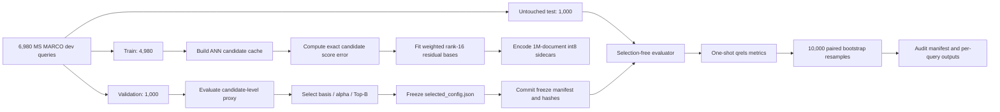

# Clean Query-Level Evaluation Protocol

## Frozen configuration

| Parameter | Value |
|---|---|
| Basis | Score-error weighted |
| Rank | 16 |
| Coefficients | Per-dimension int8 |
| Alpha | 0.75 |
| Candidate pool | Top-100 |
| Corrected candidates | Top-40 |
| Final cutoff | Top-10 |
| IVF-PQ | M=32, nlist=512, nprobe=16, nbits=8 |

## Protocol safeguards

- Split query IDs and query-vector row mappings are deterministic.
- Train, validation, and test intersections are empty.
- The test evaluator does not contain SVD, fitting, basis selection, alpha sweep, Top-B sweep, or validation loading.
- The selected configuration and evaluator were committed before the untouched test was run.
- SHA-256 hashes record the frozen configuration, basis, scales, codes, index, query vectors, document IDs, qrels, evaluator, test metrics, and per-query outputs.
- The test split must not be used for future model or hyperparameter selection.
